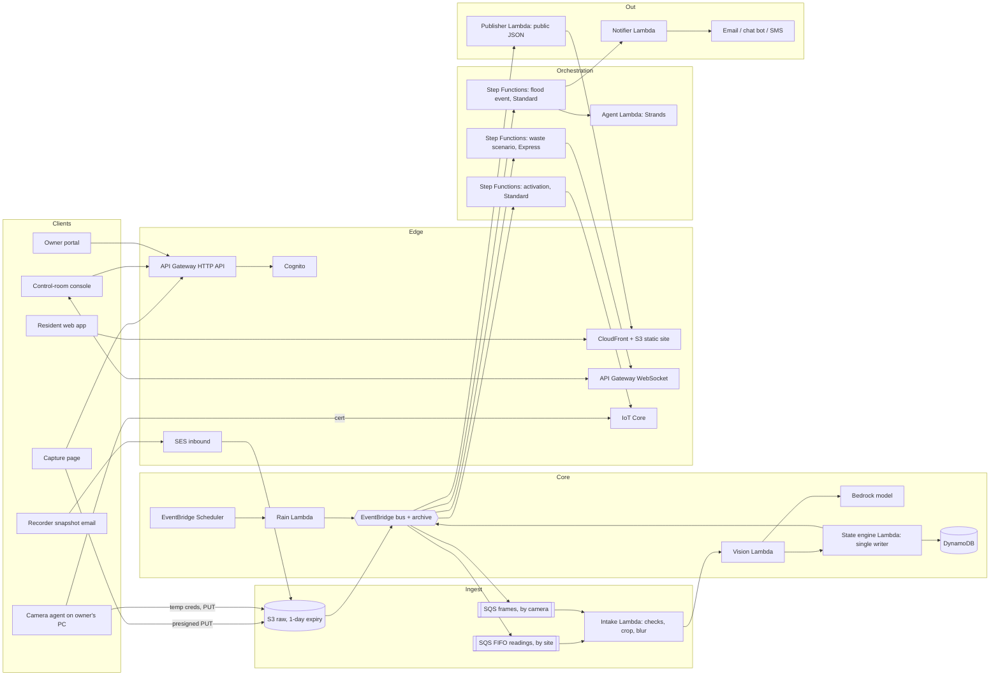

# NirmalDhara: architecture and orchestration

This document says how the system in [METHOD.md](METHOD.md) is built and run on AWS: the
components, how work moves between them, who owns each piece of state, and what happens when
something fails. Section 11 is an audit of this design: gaps found, how each is closed, and
what remains open.

Status: design. Only the core logic in `nirmaldhara/` exists as code today.

Facts about AWS services are marked **[verified]** where they were checked against AWS
documentation on 9 October 2026, and **[from memory]** where they were not.

---

## 1. Principles

1. **Serverless, no always-on compute.** Nothing runs when there is no rain. This also keeps
   the build inside free-tier credits.
2. **Events, not calls.** Components publish facts to one event bus and react to facts. No
   component calls another directly, except to read.
3. **One writer per piece of state.** A site's state is written by exactly one component.
   Everything else reads it or reacts to its change.
4. **Code decides, the model words.** State changes, alert levels and who may be alerted are
   decided by code. The language model writes messages and picks among allowed actions.
5. **Alerts never wait for the model.** If the model is slow or fails, a template message goes
   out.
6. **Idempotent everywhere.** Every handler can receive the same input twice without a second
   effect.
7. **Privacy before storage.** Frames are cropped and blurred before anything is kept or sent
   onward.
8. **Fail closed for cameras, fail loud for alerts.** A camera that loses contact stops
   sending at expiry on its own. An alert that cannot be delivered raises an alarm.

## 2. Who uses it

| Actor | Uses | Signs in with |
|---|---|---|
| Resident | Map, "can I pass", capture page | Nothing; capture links are signed |
| Guardian | Capture page from a link | Signed link |
| Camera owner | Enrolment, activity view, withdraw | Account |
| Control-room officer | Live console, acknowledge, action list | Account, officer role |
| Disaster authority officer | Declare and end emergencies | Account, authority role |
| Engineer | Repeat offenders view, fix sheets | Account, engineer role |
| Camera agent | Uploads frames, receives activation | Device certificate |

## 3. Components



### Service choices

| Need | Service | Why | Considered and not chosen |
|---|---|---|---|
| Static apps | S3 + CloudFront | Survives a flood-day traffic spike with no backend load | Amplify Hosting: equivalent; either works |
| API | API Gateway HTTP API | Cheapest request path with a built-in token check | REST API: more features than needed |
| Live console | API Gateway WebSocket | Push to officers without polling | AppSync subscriptions; IoT Core MQTT over WebSocket |
| Sign-in | Cognito user pool with groups | Roles for officer, authority, engineer, owner | Custom tokens: more to get wrong |
| Camera identity and control | IoT Core | Per-device certificate; one retained message activates a zone | Polling an API: no push, weaker identity |
| Frame storage | S3 | Direct upload, lifecycle expiry | None |
| Ordering per site | SQS FIFO, message group = site | Readings for one site are processed in order, one at a time | Kinesis: more to run for this volume |
| Compute | Lambda | Scales to zero | Fargate: only if a model is self-hosted later |
| Depth and waste reading | Bedrock (Claude), India inference profile | No model to host; structured output; inference stays in India (13.1) | SageMaker endpoint: always-on cost |
| Face and plate blur | Rekognition, in region | Frames are anonymised before leaving the region | Blur with the main model: sends raw faces onward |
| State | DynamoDB | Conditional writes for one-writer safety; TTL | RDS: always-on |
| Event routing | EventBridge bus with archive | Fan-out, filtering, and replay of past events for the demo | SNS: no replay |
| Timers | EventBridge Scheduler | 15-minute rain check; one-off re-asks | Cron in a server |
| Long-running coordination | Step Functions Standard | Waits for hours, visible execution history, idempotent start | Hand-rolled state in Lambda |
| Short high-volume flows | Step Functions Express | Cheap per run for the 5-minute scenario pass | Standard: priced per step |
| Agent | Strands Agents SDK in Lambda | Named AWS open-source tool for the hackathon | A fixed prompt: no tool use |
| Deployment | AWS SAM | One template; also an AWS open-source tool | Console clicks: not repeatable |

---

## 4. State ownership

| State | Single writer | Readers |
|---|---|---|
| Site state and smoothed depth | State engine | Everyone |
| Readings | State engine | Workflows, views |
| Flood event record | Flood event workflow, every step | Repeat offenders, fix sizing |
| Camera record and consent | Camera API | Activation workflow, intake |
| Emergency declaration | Activation workflow | Intake (to accept or discard frames), console |
| Waste observations | Vision Lambda | Scenario workflow |
| Scenario and action list | Scenario workflow | Console |
| Alerts and acknowledgements | Notifier | Flood event workflow, audit |

The state engine never calls a workflow, and a workflow never writes site state. They meet
only through events.

## 5. Event contract

One bus, `nirmaldhara`. Every event carries `city`, `site_id` or `camera_id`, `occurred_at`
(server time) and an `idempotency_key`.

| Event | Published by | Consumed by |
|---|---|---|
| `RainIndexComputed` | Rain Lambda | State engine |
| `FrameStored` | S3 (object created) | Queues, by key prefix |
| `ReadingAccepted` | State engine | Flood workflow (reactor), publisher |
| `ReadingRejected` | Intake or state engine | Metrics; capture page feedback |
| `SiteStateChanged` | State engine | Flood workflow (reactor); publisher; console |
| `PhotoRequested` | Flood workflow | Notifier |
| `AlertRequested` | Flood workflow | Notifier |
| `AlertSent` / `AlertFailed` | Notifier | Flood workflow, alarms |
| `AlertAcknowledged` | Ack API | Flood workflow |
| `EmergencyDeclared` / `EmergencyEnded` | Activation API | Activation workflow |
| `CameraOffline` | Health checker | Console |
| `WasteObserved` | Vision Lambda | Scenario workflow trigger |
| `ScenarioComputed` | Scenario workflow | Console push, notifier |
| `EventClosed` | Flood workflow | Repeat offenders, fix sizing |

The bus has an archive. Replaying a past time window re-drives the whole system, which is how
recorded floods are demonstrated and how changes are regression-tested. EventBridge replays
events grouped by minute and not in strict order **[verified]**, so handlers order by
`occurred_at`, never by arrival.

---

## 6. Flows

### 6.1 Rain check (every 15 minutes)

1. Scheduler invokes the Rain Lambda once per city.
2. It requests past and forecast rain for **all sites in one call**; the forecast API accepts
   comma-separated coordinates **[verified]**.
3. It publishes one `RainIndexComputed` per site.
4. The state engine moves CLEAR sites over threshold to WATCH and publishes
   `SiteStateChanged`.

The forecast API offers 15-minute values, but outside Europe and North America they are
interpolated from hourly data **[verified]**. The rain index therefore uses hourly values.

### 6.2 Photo to reading

1. The capture page asks the API for an upload URL. The API checks the signed link (site,
   subscriber, expiry, single-use nonce) and returns a presigned URL for the raw bucket.
2. The browser uploads two frames straight to S3.
3. S3 emits `FrameStored`. A rule sends flood photos to the FIFO queue with the site as the
   message group, and the image hash as the deduplication id.
4. **Intake Lambda:** checks position (within 150 m), age (under 5 minutes by server receive
   time), duplicate hash; crops; blurs faces and plates with Rekognition; writes the cleaned
   frame; deletes the raw one.
5. **Vision Lambda:** runs the estimators and returns a depth range, confidence and moving
   flag.
6. **State engine:** fuses, smooths, applies the trust tiers, updates the site with a
   conditional write on its version number, stores the reading, publishes `ReadingAccepted`
   and, if the state moved, `SiteStateChanged`.

Because the queue is FIFO by site, two readings for one site are never processed at the same
time **[verified]**. The conditional write is a second guard.

### 6.3 Flood event workflow (one per site per flood)

One flood event record exists per site per flood. One step function, run by two callers,
keeps it up to date and decides what is due. The low-level design is in
[DESIGN.md](DESIGN.md) section 8.

```
reactor   on SiteStateChanged or ReadingAccepted      the fast path
tick      from a timer loop, every 60 to 120 s        what becomes due as time passes

step:     read the site (owned by the state engine)
          open the event if the site has left CLEAR and none is open
          bring peaks, blocked time and counters up to date
          decide: alerts due, escalations, photo request, or close
          publish AlertRequested / PhotoRequested / EventClosed
          save the event if nobody else has saved it since it was read
```

- The workflow orchestrates asking, alerting and escalating. It does not compute state.
- A reading causes an alert through the reactor at once. It does not wait for the timer.
- The timer is one Standard workflow execution per flood, named `{site_id}-{start}`; starting
  it twice with the same name and input is a no-op **[verified]**. It holds no decisions. It
  calls the step, sleeps for as long as the step says, and repeats until the step reports the
  event closed.
- `start` is the moment the state engine recorded the site leaving CLEAR, so both callers
  agree on the event's key, the alert ids and the timer's name without talking to each other.
- Alert ids are `{site_id}#{start}#{audience}#{seq}#{kind}`. Two callers reaching the same
  decision produce the same id, and the notifier sends it once.
- The step publishes before it saves. If it dies in between, the next step makes the same
  decision with the same ids and the notifier drops the repeats. Saving first could lose an
  alert.
- An execution's history is limited to 25,000 events **[verified]**. The loop hands over to a
  fresh execution after 2,000 iterations, about 33 hours.
- An earlier version of this section used one long workflow paused on task tokens. It was
  replaced because an alert could only leave when the workflow reached its notify state, and
  because the token store was a second piece of state to keep correct.

### 6.4 Agent step

The agent Lambda receives the site record, last readings, forecast and the list of audiences
the rules allow at this level. It returns which of those to alert now and the text for each,
in the recipient's language.

- Tools are read-only except `request_photos`.
- Output is schema-checked. Anything outside the allowed audiences is dropped.
- If it exceeds 8 seconds or fails, the workflow uses fixed templates filled from the same
  numbers. The alert is never delayed by the model.
- Every decision is written to the audit table with the model and prompt version.

### 6.5 Emergency activation of cameras

1. An authority officer calls `POST /activations` with a zone and expiry.
2. The activation workflow records the declaration, then publishes **one retained message**
   to `nd/zones/{zone}/control`:

```json
{"capture": true, "interval_s": 60, "expires_at": "…", "declaration_id": "…"}
```

3. Every agent in that zone is subscribed to its zone topic. Connected agents receive the
   message at once; an agent that connects later receives the retained copy on subscribing
   **[verified]**.
4. The agent stops capturing at `expires_at` using its own clock, even if it has lost contact
   with the cloud.
5. At expiry or on `EmergencyEnded`, the workflow publishes a retained `{"capture": false}`.
6. Intake discards any frame whose camera has no active declaration at receive time. This is
   the server-side guard that makes route B (recorder email) safe.

One publish activates a whole zone. Per-camera messages on `nd/cameras/{id}/control` are used
only to change one camera's frame interval.

### 6.6 Frame to waste observation

1. The agent compares each captured frame with the last one it uploaded. If nothing has
   changed beyond a small threshold it does not upload, except for one keep-alive frame every
   5 minutes.
2. Uploaded frames go to the standard frames queue.
3. Intake crops to the owner's shared region, blurs, and compares a perceptual hash with the
   camera's last processed frame. If unchanged, the previous observation is carried forward
   and **no model call is made**.
4. Otherwise the Vision Lambda returns blocked share per inlet, litter counts, mud cover and
   vehicle count, written with a conditional write so an older frame cannot overwrite a newer
   one.
5. `WasteObserved` is published only when blocked share changes by 10 points or more.

### 6.7 Scenario and live console

- The scenario workflow (Express) runs when `WasteObserved` arrives for an area, and at least
  every 5 minutes for areas under an active declaration.
- It computes the scenarios in METHOD.md section 16.7, ranks actions, writes the result, and
  publishes `ScenarioComputed`.
- A push Lambda sends the change to every console connection subscribed to that zone.
- On connect or reconnect, the console first fetches a full snapshot over HTTP, then applies
  pushed changes. A dropped connection therefore never leaves the console silently stale, and
  every tile shows the age of its data.

### 6.8 Resident map read path

On every `SiteStateChanged`, the publisher writes one small JSON file per city to S3 behind
CloudFront with a 30-second cache. The resident app reads that file and computes passability
in the browser from the same rules as `bands.py`.

A flood-day surge of residents hits the content network only. No Lambda, API or database
call is made per resident.

### 6.9 Notifications

| Channel | Use | Constraint |
|---|---|---|
| Email (SES) | Officials | A new account can send only to verified addresses, at most 200 messages a day and 1 a second, until production access is granted **[verified]** |
| Chat bot (Telegram) | Residents, guardians, officials in the demo | Free and immediate; users must start the bot |
| SMS | Guardians and officials at scale | Sending on local routes in India requires registering the organisation and each message template with the telecom regulator's ledger system, which needs company tax and registration numbers **[verified]**; not possible within the hackathon. AWS also lists international routes, whose terms were not read |
| Web push | Residents with the app open or installed | Needs the user's permission |

The notifier treats channels as interchangeable: each subscriber has an ordered list, and a
failure on one falls through to the next. `AlertFailed` on every channel raises an alarm.

---

## 7. Data

### DynamoDB

| Table | Partition key | Sort key | Notes |
|---|---|---|---|
| `Sites` | `city` | `site_id` | State, version, smoothed depth, registry data |
| `Readings` | `site_id` | `ts` | TTL 180 days |
| `Events` | `site_id` | `start` | Kept; index on `city` + `start` for ranking |
| `Subscribers` | `sub_id` | | Index on geohash for "nearby" |
| `Alerts` | `alert_id` | | The key is the idempotency key; TTL 30 days |
| `Tokens` | `kind#id` | | Single-use nonces and photo hashes; TTL |
| `Cameras` | `zone_id` | `camera_id` | Consent record, shared region, health |
| `Activations` | `zone_id` | `start` | Declaration, officer, expiry |
| `WasteObservations` | `camera_id` | `ts` | TTL 90 days |
| `Scenarios` | `area_id` | `ts` | TTL 90 days |
| `Connections` | `zone_id` | `connection_id` | WebSocket connections; TTL |
| `Audit` | `day` | `ts#id` | Append-only; exported daily |

On-demand capacity throughout. Point-in-time recovery on `Sites`, `Events`, `Cameras`,
`Activations` and `Audit`.

### S3

| Bucket | Holds | Rules |
|---|---|---|
| `raw` | Frames as uploaded | No human access; deleted by intake after blur; expiry after 1 day as a backstop |
| `frames` | Cropped, blurred frames | Deleted after processing; frames behind an alert kept 72 hours |
| `public` | Site JSON, static app | Read through CloudFront only |
| `audit` | Daily export of the audit table | Write-once retention |
| `eval` | Labelled test images and results | Versioned |

---

## 8. Security and privacy

| Concern | Control |
|---|---|
| Who can declare an emergency | Authority role only; every declaration is audited with the officer's identity |
| Capture links | Signed, bound to site and subscriber, expire in 20 minutes, single use |
| Acknowledge links | Signed, bound to officer and alert, expire in 2 hours, single use |
| Camera agent on an untrusted PC | Own certificate; policy allows only its own upload prefix, its own zone topic and its own control topic; certificate revoked on withdrawal |
| Raw frames | Encrypted; no human read access; removed after blur |
| Faces and plates | Blurred in region before storage and before any model call |
| Fake or old photos | Position, age and duplicate checks; trust tiers stop one anonymous photo from triggering a closure recommendation |
| Abuse of public endpoints | Web application firewall rate limits; per-subscriber quotas |
| Model output | Schema-checked; cannot change state or widen an audience |
| Secrets | In Secrets Manager; none in code or on agents |
| Tenant separation | Every key begins with the city; roles are scoped to a city |
| Audit | Append-only table plus write-once export |

## 9. Reliability

| Failure | Effect | Handling |
|---|---|---|
| Model slow, throttled or down | No depth from fallback estimator | Retry with backoff; then `cannot_tell` and ask another source; alerts continue on forecast and prior readings |
| Agent step fails | No tailored wording | Templates |
| Forecast API down | No new rain index | Use the last forecast for up to 60 minutes and mark it stale; second provider as fallback |
| Duplicate S3 event or redelivery | Same frame twice | Deduplication id and idempotency keys |
| Out-of-order frames | Old frame after new | Conditional write on timestamp |
| Poison message | Handler keeps failing | Dead-letter queue after 3 tries, with an alarm |
| Burst of uploads | Model rate limit | Queue buffers; maximum concurrency set on the queue trigger **[verified]** |
| Workflow started twice | Two workflows for one flood | Deterministic event key and execution name |
| Console disconnects | Stale screen | Snapshot on reconnect; data age shown |
| Camera loses network | No frames | Agent buffers 20 frames; stops at expiry on its own |
| Area power cut | Many cameras silent | Reported as a likely power cut; forecast-only alerts continue |
| Notification channel fails | Alert not delivered | Fall through to next channel; alarm if all fail |
| Region outage | Readings, cameras and waste tracking stop | Map fails over; second region sends rain-based warnings (13.4) |

## 10. Operations

### Observability

- **Latency:** photo stored to alert sent, by stage. Bounded at 34 seconds by the stage limits
  in 13.5; typical latency not yet measured.
- **Quality:** share of `cannot_tell`, estimator disagreement, model version on every reading.
- **Health:** queue depth and age, dead-letter counts, failed alerts, cameras offline per
  zone, workflow failures.
- **Cost drivers:** model calls per hour, frames stored, messages sent.
- Alarms on dead-letter queues, failed alerts, and queue age over 2 minutes.
- Tracing across API, Lambda and Step Functions.

### Deployment

- One AWS SAM template, two stages (`dev`, `prod`).
- Tests on every push; the labelled image set is run before a model or prompt change is
  released, and a change that raises the critical-miss count is rejected.
- Model and prompt versions are configuration, recorded on every reading and decision.

### Capacity sketch

| Load | Number | Note |
|---|---|---|
| Sites in a city | 100–500 | One rain call per 15 minutes covers all |
| Flood photos in a storm | Hundreds an hour | One model call each |
| Cameras in an activated zone | 1,000 | 1.44 million frames a day at one a minute, before change detection |
| Console users | Tens | WebSocket |
| Residents on a flood day | Tens of thousands | Static file only |

---

## 11. Audit of this design

Method: each flow in section 6 was walked through asking what breaks it, what it costs at
scale, what it exposes, and what was assumed without checking. Findings are listed with what
was done about them.

### 11.1 Gaps found and closed in this document

| ID | Gap | Severity | Resolution |
|---|---|---|---|
| A-01 | Two readings for one site processed at once could corrupt state | High | FIFO queue grouped by site, plus conditional write on version (6.2) |
| A-02 | An alert could wait on a slow or failed language model | High | 8-second limit with template fallback (6.4) |
| A-03 | Raw frames with faces would be stored and sent to a model | High | Crop and blur in region before storage or model call; raw bucket has no human access and a 1-day backstop (6.2, 8) |
| A-04 | A recorder pushing snapshots by email cannot be switched off remotely, so frames could arrive outside an emergency | High | Intake discards frames with no active declaration at receive time (6.5) |
| A-05 | An agent that loses contact could keep capturing past the emergency | High | Expiry is in the activation message and enforced by the agent's own clock (6.5) |
| A-06 | Activating cameras one by one does not scale and is slow | Medium | One retained message per zone (6.5) |
| A-07 | Model cost grows with every frame from every camera | High | Change detection on the agent, hash gate before the model, and publishing only on a 10-point change (6.6) |
| A-08 | A flood-day surge of residents could overload the API | High | Static JSON through the content network; no per-resident backend call (6.8) |
| A-09 | Workflow could be started twice for one flood | Medium | Deterministic execution name (6.3) |
| A-10 | Readings arriving while the workflow is mid-step could be missed | Medium | State engine records independently; workflow re-reads state each loop (6.3) |
| A-11 | Console could show stale data after a dropped connection | Medium | Snapshot on reconnect and visible data age (6.7) |
| A-12 | Replayed and redelivered events arrive out of order | Medium | Order by `occurred_at`; conditional writes (5, 6.6) |
| A-13 | SMS, the obvious alert channel, cannot be used in India without prior registration | High | Channel list with fall-through; chat bot and email for the hackathon (6.9) |
| A-14 | New-account email limit of 200 a day would silently drop alerts | Medium | Email reserved for officials; limit alarmed (6.9) |
| A-15 | The method assumed 15-minute rain data; in India it is interpolated from hourly | Low | Rain index uses hourly values (6.1) |
| A-16 | One forecast call per site would be slow and rate-limited | Low | One call for all sites (6.1) |
| A-17 | Device clocks can be wrong, so "photo taken under 5 minutes ago" could be faked or misjudged | Medium | Age is judged by server receive time (6.2) |
| A-28 | Found while verifying: text detection for number plates is limited to 5 requests a second in the Mumbai region, about 300 frames a minute; face detection to 25 a second | Medium | The frames queue's maximum concurrency is set below the limit so frames wait instead of failing; a quota increase is requested before more than about 1,500 cameras are activated at once (13.5) |
| A-29 | Found while testing: frame differencing fired on every passing vehicle | High | A change must persist across two frames before it is sent (13.5) |

### 11.2 Gaps that were open, and how each was resolved

Each was first listed as open. Section 13 gives the resolution in full.

| ID | Gap | Resolution | Status |
|---|---|---|---|
| A-18 | Single region | Mumbai as primary with a pilot light in Hyderabad for warnings; public map fails over between regions (13.4) | Resolved in design for warnings; camera and waste side degrades |
| A-19 | Frames might be processed outside India | In-country inference profile, routed only between Mumbai and Hyderabad (13.1) | Resolved; code switched to it, not yet run |
| A-20 | Change-detection thresholds untested | Fixed thresholds replaced by a per-camera noise model; implemented and measured on synthetic frames (13.5) | Resolved in method; real footage still to be measured |
| A-21 | Latency target unmeasured | Hard upper bound from per-stage time limits (13.5) | Bounded by construction; typical latency still to be measured |
| A-22 | Forecast licence | Provider interface with two implementations (13.6) | Resolved in design |
| A-23 | Control room interface undefined | Route A becomes the same agent, run once in the control room against the video system's standard streams (13.3) | Resolved in design; the control room's video system not yet known |
| A-24 | No process for a wrong alert | Correction event, correction message and review queue (13.6) | Resolved in design |
| A-25 | Languages and accessibility | Specification (13.6) | Resolved as a specification; translations need a native reviewer |
| A-26 | Agent updates and tampering | Signed builds, managed update jobs, minimum-version gate (13.6) | Resolved in design |
| A-27 | Legal basis argued, not agreed | A state statute already obliges establishments to give footage to notified authorities; clause checklist for the agreement (13.2) | Narrowed; an agreement still has to be signed |

### 11.3 Enhancements worth making

| ID | Enhancement | Benefit | Cost |
|---|---|---|---|
| E-01 | Adaptive frame interval: shorter at inlets that are filling, longer where nothing changes | Better detail where it matters, fewer frames overall | Small; uses the per-camera control topic |
| E-02 | Ask the nearest guardian first, by distance and past response time | Faster first photo | Small |
| E-03 | Store every reading's inputs so any alert can be explained after the fact | Trust and post-event review | Storage only |
| E-04 | A "confidence over time" view per site | Shows officers when the system is guessing | Small |
| E-05 | Cross-check a camera's waste reading with a resident's flood photo of the same inlet | Catches a wrong blocked-share estimate | Medium |
| E-06 | Per-site calibration of the rain threshold run automatically after each event | Fewer false watches over time | Medium |
| E-07 | Offline-first resident app that keeps the last map | Works on a congested network | Medium |

### 11.4 Optimisations

| ID | Optimisation | Effect | Caveat |
|---|---|---|---|
| P-01 | Change detection before upload and before the model (in design) | Largest cost saving; most frames of a static street are identical | Thresholds unmeasured (A-20) |
| P-02 | One forecast call per city (in design) | Hundreds of calls become one | None |
| P-03 | Static JSON for the resident map (in design) | Read load removed from the backend | Up to 30 seconds stale; shown to the user |
| P-04 | Express workflow for the scenario pass (in design) | Priced per run, not per step | No execution history kept as long |
| P-05 | Cache the site registry in the Lambda between invocations | Fewer database reads | Must refresh on registry change |
| P-06 | Resize frames to the smallest size that keeps accuracy before the model call | Lower model cost and latency | Needs measuring against the test set |
| P-07 | A smaller, cheaper model as a first pass, the larger model only on uncertain frames | Lower cost per frame | Adds a second failure mode; adopt only if the test set shows no rise in critical misses |
| P-08 | Batch several frames from one camera into one model call | Fewer calls | Longer delay per frame; unsuitable for flood photos |
| P-09 | Prompt caching for the fixed instruction | Lower input cost | The current instruction is likely below the minimum cacheable length, so no gain today |

### 11.5 Status of every factual claim checked

| Claim | Status |
|---|---|
| Sending SMS on local routes in India needs organisation and template registration | Verified |
| Step Functions Standard history limit of 25,000 events; Express runs at most 5 minutes | Verified |
| WebSocket connections last at most 2 hours, with a 10-minute idle timeout | Verified |
| IoT policies can restrict a device by its own name or attributes | Verified |
| The model is available with inference kept inside India | Verified |
| Face and text detection are available in the Mumbai region | Verified; not offered in Hyderabad, and rate-limited (A-28) |
| IoT Core is available in Mumbai | Verified; not offered in Hyderabad, as 13.4 assumes |
| DynamoDB global tables are available wherever DynamoDB is | Verified |
| Email receiving is available in the Mumbai region | Verified |
| New email accounts: verified recipients only, 200 a day, 1 a second | Verified |
| Global forecast model output is free on AWS Open Data | Verified: bucket `noaa-gfs-bdp-pds`, updated four times a day |
| The reader's client class and request fields exist in the SDK | Verified against the installed SDK (version 0.113.0); not run against a real model |
| City video systems can re-stream cameras over RTSP | General industry practice; the system used in Hyderabad was searched for and not found |

---|---|
| SMS to India needs sender and template registration | From memory |
| Step Functions history limit of 25,000 events | From memory |
| WebSocket connections last at most 2 hours with a 10-minute idle timeout | From memory; the console's reconnect logic assumes it |
| IoT policies can restrict a device to a topic named by one of its own attributes | From memory |
| The model is available with inference kept inside India | Verified from an AWS announcement of 29 September 2026 (13.1) |
| Rekognition is available in the Mumbai region | From memory |
| DynamoDB global tables and IoT Core are available in the Hyderabad region | Not checked (13.4) |
| City video systems can re-stream cameras over RTSP | General industry practice; not checked for Hyderabad (13.3) |
| Global weather forecast data is published free on AWS Open Data | From memory (13.6) |
| Email receiving is available in the Mumbai region | Verified |

---

## 12. What is built for the hackathon

| Part | Built | Simplified |
|---|---|---|
| Core logic | Yes (exists) | |
| Photo to reading | Yes | Fallback estimator only; blur included |
| Rain check | Yes | One city |
| State engine and FIFO queue | Yes | |
| Flood event workflow | Yes | Escalation to one backup contact |
| Agent step | Yes | Two audiences |
| Notifications | Email and chat bot | No SMS |
| Resident map | Yes | Static JSON |
| Camera agent | Yes, on one PC | Route C only |
| Emergency activation | Yes | One zone |
| Waste observation and flood scenario | Yes | Dust scenario as a calculation only |
| Live console | Yes | One zone |
| Repeat offenders and fix sizing | If time allows | Replayed events |
| Second region, SMS, routes A and B | No | Described only |

---

## 13. Resolutions of the open gaps

Each gap in 11.2 is resolved by a different kind of method: a platform capability, a statute,
a reduction to something already designed, a second region, a measurement, or a protocol.

### 13.1 Where the model runs (A-19): in-country inference

Amazon Bedrock offers an India inference profile that routes requests only between the Mumbai
and Hyderabad regions **[verified, AWS announcement of 29 September 2026]**.

| Item | Value |
|---|---|
| Profile | `in.anthropic.claude-opus-5` (also Sonnet 5 and Haiku 4.5) |
| Routing | Between `ap-south-1` and `ap-south-2` only |
| Data | Not stored in the destination region; logs and billing stay in the source region |
| Endpoint | `bedrock-runtime` |

Consequences for the design:
- Frames never leave India. The earlier fallback, sending blurred frames abroad with the
  authority's agreement, is no longer needed.
- The newest model generation is offered in these regions only through global routing, so the
  in-country choice is one generation older. The labelled test set decides whether that costs
  accuracy.
- The announcement notes that content flagged by automatic safety checks can be subject to
  human review by AWS for certain models. This goes in the agreement in 13.2.
- `reader.py` now defaults to this profile and the Mumbai region. Its client class and
  request fields were checked against the installed SDK, and two tests run it against a
  stand-in client. It has not been run against the real model.

### 13.2 Legal basis (A-27): an existing statute, and what the agreement must say

**Statute.** The Telangana Public Safety (Measures) Enforcement Act, 2013 requires
establishments to install CCTV at entry, exit and parking areas. Section 3(2) requires them to
store footage for 30 days and provide it to the Inspector of Police or to any other authority
the Government notifies **[verified against the section text]**.

**How this changes the route.**
- For establishments in Telangana, sharing with a notified authority is an existing duty, not
  a new request.
- The shortest path is through the police control room, which already receives community
  feeds, or by having the disaster authority notified under the Act.
- Homes are outside the Act. For them the design continues to rely on consent alone.

**What the agreement with the authority must contain.** This is a checklist for a lawyer, not
legal advice.

| Clause | Content |
|---|---|
| Roles | The authority decides purpose and means and is responsible for the data; the project operates the system on its instructions |
| Purpose | Flood safety and drain-waste tracking during declared emergencies; no other use |
| Trigger | Only an authorised officer's declaration, with zone and expiry |
| Data | Frames cropped to road and drain, faces and plates blurred, single frames not video |
| Location | Processing inside India; the two regions named |
| Retention | Raw frames deleted after processing; evidence frames 72 hours; counts kept |
| Access | Named roles; every view logged |
| Owner rights | See activity, withdraw at any time |
| Review by the cloud provider | The possibility of human review of flagged content, stated plainly |
| Breach | Who is told, and within what time |
| Audit | Authority may inspect logs; write-once export |
| Exit | Deletion of all data and revocation of all device certificates |

This gap cannot be closed by engineering. It is narrowed to one signature.

### 13.3 City control room route (A-23): reduce it to route C

A separate interface is not needed. City control rooms run video management software, and such
software re-streams its cameras over the standard RTSP protocol.

- **Route A is the route C agent, run once inside the control room**, with a list of camera
  streams in place of one.
- It applies the same crop, the same change detection and the same outbound-only upload.
- One device certificate per gateway; each camera keeps its own id and zone.
- The control room keeps full control: it chooses which cameras are in the list.

What remains is finding out which video system Hyderabad's control room runs and confirming it
re-streams. No design work depends on the answer.

### 13.4 Single region (A-18): pilot light in a second Indian region

The safety-critical part is small: knowing it is raining hard at a site, and telling people.
Only that part is duplicated.

| Part | Primary (Mumbai) | Second region (Hyderabad) | On primary failure |
|---|---|---|---|
| Public map file | S3 | Replicated copy | CloudFront origin group fails over for read requests **[verified]** |
| Model calls | In-country profile | Same profile | Already routed across both regions |
| Site and subscriber data | DynamoDB | Global table replica | Readable in the second region |
| Rain check and notifier | Running | Deployed, idle | Started by the heartbeat rule below |
| Flood workflows, cameras, waste | Running | Not deployed | Paused; agents buffer frames and stop at expiry |

**Heartbeat rule.** The primary writes a timestamp to the replicated bucket every 5 minutes. A
scheduled check in the second region reads it every 5 minutes. If it is older than 15 minutes,
the second region runs the rain check and sends forecast-only alerts, labelled "unconfirmed",
until the heartbeat returns.

What is lost in a primary outage: depth readings, camera activation and waste tracking. What is
kept: the map as last known, and rain-based warnings.

Checked against AWS documentation: global tables are available in every region that has
DynamoDB. IoT Core, face detection and text detection are **not** offered in the Hyderabad
region. That matches this design, which never runs cameras or frame processing there, and it
means that part cannot be made multi-region inside India today.

### 13.5 The unmeasured numbers (A-20, A-21)

**Change detection: thresholds replaced by a noise model, then measured.**
A fixed threshold cannot suit both a clean camera and a noisy one. `change.py` works in three
steps.
1. **Learn the noise.** It records the difference between each pair of consecutive frames and
   takes the lower quartile as the camera's quiet-frame noise. The lower quartile is used so
   that frames with traffic in them do not inflate it.
2. **Compare with the last frame sent**, not the previous frame, with overall brightness
   removed. A passing cloud does not register; change that adds up does.
3. **Require the change to persist.** A frame is sent only if it also matches the frame before
   it. A passing vehicle differs from the frame before and is ignored. Waste that has settled
   does not, and is sent.

Measured on synthetic frames, 320 by 240, six hours at one frame a minute, with slowly changing
light, bursts of extra noise and JPEG compression:

| Vehicles present in | Frames sent |
|---|---|
| 0% of frames | 72 of 360 (20%) |
| 30% of frames | 80 of 360 (22%) |
| 70% of frames | 79 of 360 (22%) |
| 100% of frames | 72 of 360 (20%) |

| Behaviour | Result |
|---|---|
| Object that appears and stays | Sent on its second frame |
| Object that appears and leaves | Not sent |
| Steady brightness drift | No extra frames |
| Waste growing slowly | Not caught by differencing; carried by the keep-alive frame every 5 minutes |

What this shows, and what it does not:
- The 20% floor is the one-in-five keep-alive. Traffic added at most two points to it.
- Slow build-up is reported by keep-alive frames, so the worst delay in seeing it is 5 minutes.
  The differencing step earns its place on sudden changes, such as a load of waste dumped.
- Before the persistence rule, every vehicle triggered a send. Testing found that, and an
  earlier flaw where rounding in 8-bit images triggered sends before noise was learned.
- These are synthetic frames. Real rain, headlights at night and camera auto-exposure must
  still be measured on real footage.

**Frame-processing rate limit (A-28).** In the Mumbai region, text detection (used to find
number plates) allows 5 requests a second and face detection 25 **[verified]**. At a 20% send
rate, 1,000 cameras produce about 200 frames a minute against a ceiling of about 300. The
queue's maximum concurrency is set so frames wait in the queue when the ceiling is reached,
and a quota increase is requested ahead of any larger activation.

**Latency: bounded by construction.**
The target cannot be measured until the pipeline runs, so each stage is given a time limit and
a defined result when it is exceeded.

| Stage | Limit | On exceeding it |
|---|---|---|
| Upload to queue | 2 s | Alarm on queue age |
| Intake: checks, crop, blur | 5 s | Retry once, then dead-letter |
| Model reading | 15 s | `cannot_tell`; ask another source |
| State engine | 1 s | Retry |
| Agent wording | 8 s | Template message |
| Send | 3 s | Next channel |
| **Worst case, photo to alert** | **34 s** | |

So the bound is 34 seconds, not the earlier 30, and the target is restated as: typical under
20 seconds, never over 34 without an alarm. Typical latency is still to be measured.

### 13.6 The smaller items

**Forecast licence (A-22).** The rain check talks to a provider interface, not to one service.
- Hackathon: the free forecast API, which is permitted for non-commercial use.
- Deployment: the US weather agency's global forecast model on AWS Open Data **[verified]**:
  bucket `noaa-gfs-bdp-pds`, updated four times a day, open for any use with attribution. It
  needs a decoder for the weather file format, and its grid is coarser than a city street.
  The national weather service's data is the alternative.
- If the two disagree by more than a set margin, the higher rain value is used, since a missed
  watch costs more than a false one.

**Wrong alerts (A-24).**
1. Any officer, guardian or resident can mark an alert "wrong" from the alert itself.
2. A trusted reading that contradicts a live alert publishes `AlertCorrected`.
3. A correction goes to the same audience, by the same channel, within 2 minutes, stating what
   was wrong.
4. Every CRITICAL alert and every correction enters a review queue with its inputs.
5. Reviewed cases are added to the labelled test set, so the same error is tested for
   afterwards.
6. Two rates are reported per month: alerts later corrected, and floods with no prior alert.

**Languages and accessibility (A-25).**
- Languages for Hyderabad: Telugu, Urdu, Hindi and English.
- Alert templates are translated once and checked by a native speaker. Text written by the
  model at run time is used only in a language whose templates have been checked.
- Status is never shown by colour alone: each state has a colour, an icon and a word.
- Every alert can be read aloud by the phone.
- The map file is kept under 50 KB (measured: 42 KB for 500 sites, 10 KB compressed) and the app shows the last map when offline.
- Contrast and text size follow the common web accessibility standard, level AA.

**Agent updates and tampering (A-26).**
- The agent is a signed build; the installer checks the signature.
- Updates are delivered as managed jobs through IoT Core and applied only if signed.
- The agent reports its version in each heartbeat. Frames from a version below the minimum are
  refused.
- Behaviour that may need changing (frame interval, crop, thresholds) is configuration sent
  from the cloud, so most changes need no update.
- The cloud trusts no agent: every frame is checked on arrival whatever the agent claims.

### 13.7 What is still open after this pass

| Item | Why it remains | What was tried |
|---|---|---|
| A signed agreement with the authority | Needs people, not design | Statute found; clause checklist written |
| Change detection on real camera footage | Needs footage | Measured on synthetic footage with traffic, light change and compression |
| Typical photo-to-alert latency | Needs the pipeline running | Worst case bounded at 34 seconds |
| Accuracy of the in-country model against the newer one | Needs AWS credentials and the labelled test set | Reader verified against the SDK and a stand-in client |
| Which video system the control room runs | Not published | Searched; not found. The design does not depend on it |
| The road-dust formula | The source document could not be read by the tools available | Two attempts; the dust scenario stays labelled approximate and unverified |
| Terms of international SMS routes to India | Not read | Local-route requirement verified |
