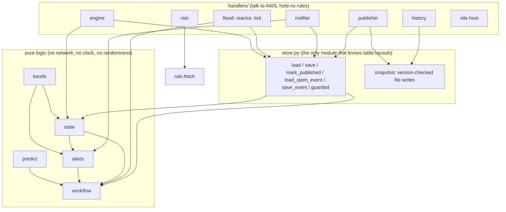
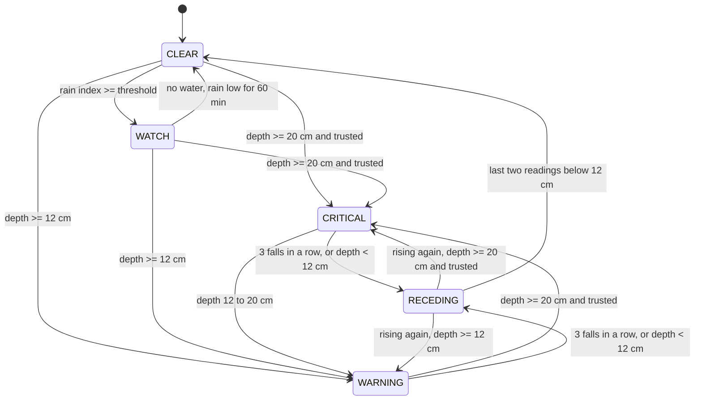
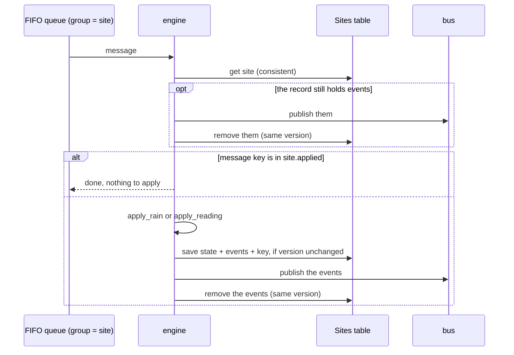
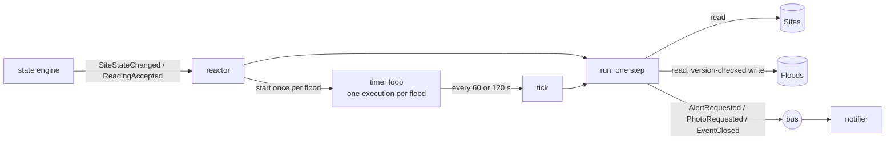
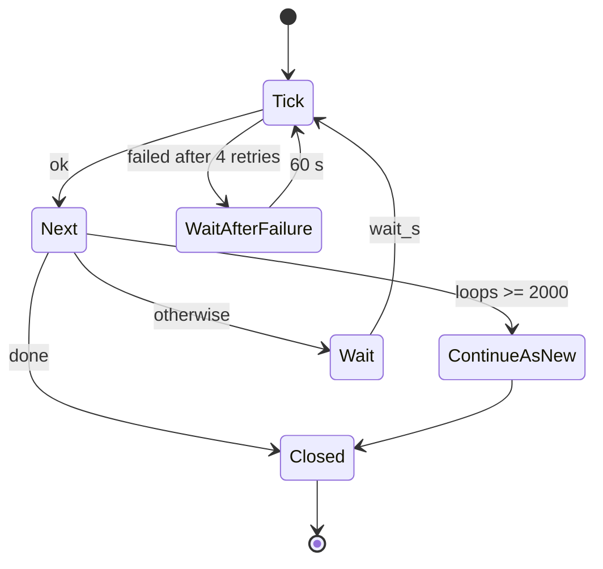
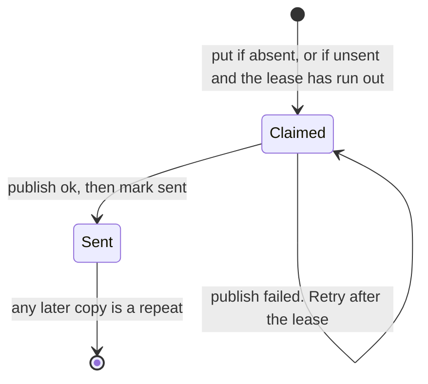

# NirmalDhara: low-level design

[ARCHITECTURE.md](ARCHITECTURE.md) is the high-level design: components, events, flows and
who owns which state. [METHOD.md](METHOD.md) is the method: thresholds, rules and their
sources. This document is the level below both. It says, for every part that exists in code,
what the records are, how they are stored, which algorithm is used and why, what happens when
two things run at once, what happens when something fails, and which test proves it.

**Status words.** *Running* means the code is deployed to AWS and has been exercised there
(`docs/smoke-test.md`, the replay). *Built* means the code exists with tests but has not run on
real input or been deployed. *Planned* means designed here and not written. Paths are relative
to `src/` unless they start with another folder. Section 17.2 lists what is still unproven.

Contents: 1 modules · 2 records · 3 storage · 4 data structures · 5 algorithms · 6 site state
machine · 7 state engine · 8 flood workflow · 9 notifier · 10 events · 11 failures ·
12 idempotency · 13 timing · 14 permissions and settings · 15 interfaces · 16 planned parts ·
17 review findings · 18 test inventory · 19 differences from the high-level design · 20 demonstration tools, the pages and hosting

---

## 1. Modules

### 1.1 From component to module

Every file under `src/` is listed here, and `tests/test_design_doc.py` fails if one is not.

| Component | Module | Status |
|---|---|---|
| Rain check (6.1) | `nirmaldhara/rain.py`, `handlers/rain.py` | running; live forecast, nine sites |
| State engine (6.2) | `nirmaldhara/state.py`, `nirmaldhara/store.py`, `handlers/engine.py` | running |
| Depth bands and passability | `nirmaldhara/bands.py` | running (alerts, sheet); the browser copy is `web/rules.js` |
| Flood workflow (6.3) | `nirmaldhara/workflow.py`, `handlers/flood.py`, `statemachine/flood.asl.json` | running |
| Notifier (6.9) | `handlers/notifier.py` | running; to one topic, no person subscribed |
| Alert rules and wording (6.4) | `nirmaldhara/alerts.py` | running |
| Map file (6.8) | `nirmaldhara/publish.py`, `handlers/publisher.py` | running |
| Flood history file | `nirmaldhara/history.py`, `handlers/history.py` | running |
| Version-checked file writes | `nirmaldhara/snapshot.py` | running; used by both file writers |
| Site host (stand-in for CloudFront) | `handlers/site.py` | running |
| Prediction (METHOD 7) | `nirmaldhara/predict.py` | built; feeds the "cars lose passage" line, not yet seen in a delivered alert |
| Depth from a photo | `nirmaldhara/reader.py` | built; **never run against the real model** |
| Intake checks, crop, blur | `nirmaldhara/intake.py` | built as functions; no handler |
| Signed links (8) | `nirmaldhara/tokens.py` | built |
| Camera change gate (6.6) | `nirmaldhara/change.py` | built |
| Nearby lookup | `nirmaldhara/geo.py` | built; no caller yet |
| Volume curve (METHOD 15) | `nirmaldhara/volume.py` | built; no caller yet |
| Command line | `nirmaldhara/__main__.py` | running locally: `check` and `read` |
| Agent wording, scenario engine, fix sheet, camera agent, activation, acknowledgement, channels, upload | | planned, section 16 |

Outside `src/`: `template.yaml` (deployed, 51 resources), `web/` (the pages and their scripts:
`rules.js`, `glyph.js`, `data.js`, `sites.js`, `sheet.js`, `section.js`, `guide.js`, `map.js`,
`offenders.js`) and the scripts in section 20.

### 1.2 Layers



Three rules hold the layers apart:

1. **Pure logic takes time as an argument.** No function in `state`, `workflow`, `alerts`,
   `bands` or `predict` reads the clock. A handler reads it once and passes it down. This is
   what lets a test walk a site through an hour of flood in a millisecond, and what makes a
   decision repeatable: the same inputs always give the same output.
2. **Only `store.py` knows how a record is laid out in a table.** Handlers ask for a `Site` or
   a `FloodEvent` and get one.
3. **Only two functions call an outside service from the package:** `reader.read_depth` (the
   model) and `rain.fetch` (the forecast). Everything else runs with no account and no network,
   which is why the whole suite (section 18) finishes in seconds.

---

## 2. Records

All records are frozen dataclasses: values that cannot change after they are made. A step
takes a record and returns a new one. The caller therefore holds both the before and the
after, which is exactly what a version-checked write needs, and a failed write leaves nothing
half-changed.

### 2.1 `Reading`

| Field | Type | Meaning |
|---|---|---|
| `ts` | seconds | When the server received it. Never the phone's clock |
| `low`, `high` | cm | Depth range. A reading is never one number |
| `confidence` | 0 to 1 | From the estimator |
| `source` | `cctv`, `guardian`, `resident` | Decides trust |
| `device` | text | Tells two residents apart |

### 2.2 `Site`

| Field | Meaning | Changed by |
|---|---|---|
| `site_id` | Key | never |
| `rain_threshold_mm` | Rain index that starts a watch. Default 20 | Refreshed from the registry on every load |
| `state` | CLEAR, WATCH, WARNING, CRITICAL, RECEDING | `apply_rain`, `apply_reading` |
| `version` | Rises by one on every step | every step |
| `readings` | Accepted readings, newest last, at most 12 | `apply_reading` |
| `held` | One sudden jump waiting to be confirmed | `apply_reading` |
| `low`, `high` | Smoothed depth range: medians of the last 3 | `apply_reading` |
| `trusted` | A trusted source vouches for the current depth | `apply_reading` |
| `water_seen` | Depth has reached 12 cm during this watch | `apply_reading` |
| `rain_low_since` | When rain first fell back under the threshold | `apply_rain` |
| `since` | When the site last left CLEAR | on leaving CLEAR |
| `applied` | Keys of the last 16 messages applied, oldest first | the engine handler |
| `events` | Facts produced by the last step. Stored with the record until published (section 7). Not compared | every step |

Invariants (enforced by tests, section 18): `low <= high`; `len(readings) <= 12`; `version`
rises by exactly one per step; `state == CRITICAL` implies `high >= 20` and `trusted`.

`since` is the anchor for the flood event's identity (8.3). `applied` and the stored `events`
are what make the engine safe against a crash and against a repeated message (section 7).

### 2.3 `FloodEvent`

One per site per flood. Written only by the flood workflow.

| Field | Meaning |
|---|---|
| `site_id`, `start` | Key. `start` is the site's `since`, so it is the same for every caller |
| `version` | Rises by one per recorded step |
| `last_fold_at` | When the event was last brought up to date |
| `peak_low`, `peak_high` | Highest smoothed range seen |
| `blocked_two_wheelers_s`, `blocked_cars_s` | Time the top of the range sat at or above 15 cm and 20 cm |
| `water_seen` | Depth reached 12 cm at some point. Decides flood or no flood at close |
| `confirmed` | That depth was vouched for by a trusted source |
| `asks`, `unanswered_asks`, `last_ask_at` | Photo requests sent, sent since the last reading, and when |
| `alerts` | `{audience: AlertRecord}`: the last alert to each audience |
| `loops` | Steps recorded |
| `closed_at`, `outcome` | Set once, at close. `flood` or `no_flood` |

`AlertRecord` is a small map: `kind`, `level` (0 to 4, the state's rank when sent),
`sent_at`, `seq` (0, 1, 2 … per audience), `contact` (0 is the first contact, 1 the next),
`acked_at`.

### 2.4 `Plan`

What one step has decided. It changes nothing by itself.

| Field | Meaning |
|---|---|
| `alerts` | `{audience: kind}` due now |
| `escalate` | Audiences whose unacknowledged alert goes to the next contact |
| `ask_photos` | Whether to ask guardians for photos |
| `close` | `flood`, `no_flood` or nothing |
| `wait_s` | How long the timer should sleep before the next step |

---

## 3. Storage

Three tables are defined in `template.yaml`. All use on-demand capacity.

### 3.1 `Sites`

| | |
|---|---|
| Key | `city` (partition), `site_id` (sort) |
| Attributes written by the engine | `doc` (the whole `Site` as JSON text), `state`, `version` |
| Attributes owned by the registry | `name`, `lat`, `lon`, `rain_threshold_mm`, contacts |
| Recovery | Point-in-time |

- **Why one JSON string.** DynamoDB returns numbers as decimals. One string avoids a
  conversion at every field and keeps the record's shape in one place (`store.to_doc`,
  `store.from_item`).
- **Why `state` and `version` are also separate attributes.** `version` must be visible to the
  write condition. `state` lets the rain check and the map publisher read states without
  parsing `doc`.
- **Why the engine uses an update, not a put.** A put replaces the whole item and would erase
  the registry's attributes. `store.save` sets only its three.
- **Why the events are inside `doc`.** A change and the events it produces must be saved
  together or not at all. One item, one write, is the simplest way to get that (section 7).
- **Size.** A full record with 12 readings and 16 message keys is about 2.5 KB, far under the 400 KB item limit
  (estimated from the field list, not measured).

| Access | Call | Read type |
|---|---|---|
| One site | `get_item(city, site_id)` | Strongly consistent |
| All sites of a city | `query(city)`, every page | Eventually consistent is enough: the rain check runs again in 15 minutes |
| Save | `update_item` with condition `attribute_not_exists(version) OR version = :expected` | |

The single-site read is strongly consistent on purpose. The reactor is woken by an event
saying the site changed; if it then read a copy from before the change, it would see nothing
to do and the alert would wait for the next timer tick.

### 3.2 `Floods`

| | |
|---|---|
| Key | `site_id` (partition), `start` (sort, number) |
| Attributes | `doc` (the `FloodEvent` as JSON), `version`, `open` |
| Recovery | Point-in-time |

| Access | Call |
|---|---|
| The open event of a site | `query(site_id)`, newest first, limit 1, strongly consistent; closed means none |
| Save | `update_item` with the same version condition |
| A site's flood history (repeat offenders) | `query(site_id)` |
| Ranking across a city | planned: an index on `city` and `start` |

"Newest first, limit 1" is enough because a site has at most one open event and it is always
the newest: a new one is opened only after the site has been CLEAR, which is what closes the
previous one.

### 3.3 `Alerts`

| | |
|---|---|
| Key | `alert_id` |
| Attributes | `site_id`, `audience`, `kind`, `sent`, `claimed_at`, `sent_at`, `expires_at` |
| Expiry | `expires_at`, 30 days after the claim, removed by the table's time-to-live |

One item per alert id. It exists for one purpose: to make sending happen once (section 9).

ARCHITECTURE.md section 7 keyed this table by site and time. Keying it by the alert id is
simpler and is what the notifier needs; section 19 records the difference.

### 3.4 Tables still to be defined

`Readings` (history beyond the last 12), `Subscribers` (with a geohash index), `Tokens`
(single-use nonces and photo hashes), and the camera, activation, waste, scenario, connection
and audit tables in ARCHITECTURE.md section 7.

---

## 4. Data structures, and why each was chosen

| # | Need | Structure | Cost | Where |
|---|---|---|---|---|
| 4.1 | Handle one site's messages in order, one at a time | Per-key ordered log: a FIFO queue whose message group is the site id | Order kept by the queue | `template.yaml`, `handlers/engine.py` |
| 4.2 | Stop two writers overwriting each other | Version number with compare-and-set | One conditional write | `store.save`, `store.save_event` |
| 4.2a | A saved change must never lose its events | Outbox: the events sit in the same record as the change until published | One extra write per step that produced events | `Site.events`, `engine.flush` |
| 4.2b | "Has this message been applied?" | Bounded list of the last 16 message keys, each the first 16 hex digits of the SHA-256 of the message body | O(16) | `Site.applied`, `engine.message_key` |
| 4.3 | Recent readings | Bounded tuple of 12 | O(1) per reading | `state.py` |
| 4.4 | Last alert per audience | Hash map: audience to record | O(1) | `FloodEvent.alerts` |
| 4.5 | "Send this once" | A set of ids, held as table items with a lease and an expiry | One conditional write | `notifier.claim` |
| 4.6 | Timer per flood | A durable loop: one Step Functions execution, named after the flood | 3 state changes per loop | `flood.asl.json` |
| 4.7 | Camera noise level | Sliding window: `deque(maxlen=60)` | O(1) append; lower quartile of 60 per frame | `change.py` |
| 4.8 | Frame comparison | 32 x 32 grid of floats, mean removed | 1,024 subtractions | `change.signature` |
| 4.9 | "Who is within 500 m?" | Geohash cell per subscriber, indexed; query the cells a circle touches, then filter exactly | At most 9 cell lookups plus matches | `geo.py` |
| 4.10 | Rain for hundreds of sites | Hash map from forecast grid cell to the sites in it | One forecast point per cell | `rain.grid_cells` |
| 4.11 | Depth to stored volume and back | Sorted breakpoint heights with running-total volumes; binary search, then a closed-form step | O(n²) to build, O(log n) per lookup | `volume.VolumeCurve` |
| 4.12 | "Have we seen this photo?" | Set of SHA-256 digests with a time-to-live | O(1) | `intake.check` |
| 4.13 | Tamper-proof links | Claims plus HMAC-SHA256, compared in constant time | O(length) | `tokens.py` |
| 4.14 | Public map | Array of fixed-order rows under one header naming the columns | 15.3 | `publish.py` |
| 4.15 | Top actions for an area | Heap of size k | O(n log k) | planned |
| 4.16 | Which inlets serve which site | Adjacency map: site to inlets, inlet to cameras | O(1) per hop | planned |

**4.3, why 12.** Smoothing uses the last 3 readings, "falling" uses the last 4, the rise rate
uses the last 6, and trust looks back ten minutes. Twelve covers all of them, keeps the record
a fixed small size, and makes every per-reading operation constant time.

**4.9, the nearby lookup.** A geohash names a rectangle with a short string. At six characters
a cell is about 1.2 km by 0.6 km. Each subscriber is stored with its cell as an indexed
attribute. `cells_covering(lat, lon, 500)` walks the circle's bounding box a cell at a time;
for 500 m that is at most 9 cells, each one index query. `within` then applies the exact
distance. Tested with 2,000 random points around Hyderabad: every point inside the radius
falls in a returned cell.

**4.11, the volume curve.** The ponded length at water height `z` is piecewise linear in `z`,
with a corner at every height in the road profile. Volume is its integral, so it is piecewise
quadratic. Build: sort the distinct heights, compute the length at each, accumulate volume by
the trapezium rule, which is exact for a linear length. `volume(d)` is a binary search plus
the exact quadratic remainder. `depth(v)` is a binary search on the running totals and then
the quadratic formula; this inverse is what the replay check needs. Tested against the closed
form for a V-shaped dip (78.75 m³ at 0.5 m), for round trip, for never decreasing, and for a
flat bottom.

---

## 5. Algorithms

`n` is the number of readings considered, never more than 12.

| Algorithm | Method | Cost | Why this method |
|---|---|---|---|
| Rain index | `P1 + 0.5 (P3 − P1) + N1`, hourly values | O(1) | METHOD 4 |
| Fusing one photo's estimates | Confidence-weighted median of the low ends; highest credible high end; confidence halved when estimates disagree by more than two bands | O(k log k) | A median ignores one wild estimate; the highest credible top keeps the answer cautious |
| Smoothing | Median of the last 3 lows and of the last 3 highs | O(1) | One bad reading cannot move the state |
| Repeated reading | A reading equal in every field to one already held or accepted changes nothing | O(n) | A repeat must not count twice in the median or in "the last two readings" |
| Trust | A trusted source, or an earlier reading within 10 minutes and one band from a trusted source or a different device | O(n) | METHOD 6 C5 |
| Jump hold | A reading two bands away within 2 minutes is parked; the next one confirms or replaces it | O(1) | A wrong reading costs one extra photo, not a false alarm |
| Site transition | Function of (state, smoothed depth, trust, trend) | O(n) | Section 6 |
| Rise rate | Theil–Sen: median of the slopes of all pairs | O(n²), at most 66 pairs | Unmoved by outliers in up to 29% of points; least squares is moved by one |
| Time to no-go | (limit − depth) / rate per class | O(classes) | |
| Time until cars lose passage | Time to no-go from the top of the range (sooner) and the bottom (later), rate from the last 6 readings | 15 pairs | A range in gives a range out |
| Passability | Top of the range against the class limit; confidence at least 0.6; moving water unsafe from 12 cm | O(1) | The cautious end decides |
| Confidence of the current depth | Lowest confidence among the 3 readings smoothed | O(1) | An alert should not claim more than its weakest input |
| What is due | For each audience the state allows: never alerted, or the state's rank has risen, or 20 minutes have passed | O(audiences) | `alerts.due` |
| Escalation | An unacknowledged closure recommendation, 5 minutes old, while CRITICAL, with a contact left | O(audiences) | 8.4 |
| Blocked time | Add the gap since the last step, capped at 5 minutes, while the top of the range is over the class limit | O(1) | The cap stops an outage being counted as a blocked road |
| Frame gate | Difference from the last sent frame and from the previous frame, against a threshold from the noise window | O(pixels) to shrink, then O(1,024) | ARCHITECTURE 13.5 |
| Distance | Haversine | O(1) | |
| Sharpness | Variance of a 4-neighbour Laplacian on a 320-pixel-wide copy | O(pixels) | Cheap and standard; no model call |
| Link check | Recompute the signature, constant-time compare, then purpose and expiry | O(length) | Does not leak the signature byte by byte |

Planned algorithms:

| Algorithm | Method | Cost | Note |
|---|---|---|---|
| Required pumping (METHOD 15.5) | Binary search on pump rate; each probe replays the recorded floods | O(log(range / step)) replays | Valid because peak depth can only fall as pumping rises |
| Uncertainty in the fix sheet | 1,000 runs with inputs drawn from their error ranges; report median and 10th to 90th percentile | O(1,000 × floods) | |
| Inlet capacity | Smaller of weir and orifice flow, perimeter and area scaled by the clear share | O(1) per inlet | METHOD 16.10 |
| Which inlets to clear first | Every subset of up to 8 inlets (256 cases); keep the best set of each size | O(2^m), m ≤ 8 | Clearing one inlet changes the value of the next, so ranking one at a time can be wrong. Above 8, greedy, and say so |
| Power-cut detection | Count cameras newly offline per geohash cell | O(cameras in zone) | |

---

## 6. The site state machine



The exact rule, in the order the code applies it:

```
state_for(site):
  1  state in {WARNING, CRITICAL} and the last 4 readings fall each time   -> RECEDING
  2  state == RECEDING:
       last two readings both below 12 cm                                  -> CLEAR
       last reading not above the one before                               -> RECEDING
       otherwise (rising again) go on to 3
  3  smoothed high >= 20 cm and trusted                                    -> CRITICAL
  4  smoothed high >= 12 cm                                                -> WARNING
  5  state in {WARNING, CRITICAL}                                          -> RECEDING
  6  state == RECEDING                                                     -> CLEAR
  7  otherwise                                                             -> unchanged
```

Details that matter:

- **Rain alone** moves CLEAR to WATCH, and ends a WATCH that has seen no water once the index
  has been under the threshold for an hour. Rain never moves a site to WARNING.
- **Sticky trust.** Once a trusted source has put a site at CRITICAL, a later untrusted
  reading that still shows 20 cm or more does not withdraw the trust. Without this, one
  resident's photo could downgrade a confirmed critical site.
- **An untrusted critical depth** stays at WARNING, but residents are still told not to enter
  (`alerts.due`). The public is warned on one photo; the recommendation to close a road waits
  for a trusted one.
- **A repeated reading** (equal in every field to one already accepted or held) changes
  nothing but `version` and produces no event.
- **A held reading** changes nothing but `held` and `version`. It produces `ReadingHeld`, not
  `ReadingAccepted`.

---

## 7. The state engine

`handlers/engine.py`. The only writer of site state.

### 7.1 One message



```
process(message):
  key = first 16 hex digits of SHA-256(message body)
  repeat up to 3 times:
    before = load site
    flush(before)                      events an earlier run saved and never published
    if key in before.applied: return   already applied
    after = apply(before, message), with key appended to applied (last 16 kept)
    save(after) if the version is unchanged, else start again
    flush(after)
    return

flush(site):
  if site.events: publish them; rewrite the record without them at the same version
```

### 7.2 Two faults this design removes

**A lost event.** The first version saved the new state and then published its events. If the
function died in between, the state was saved and the event never existed. A lost
CLEAR → WATCH event meant no flood event was opened and no photos were requested.

Three separate things now stand against it:

1. **The outbox.** The events are written in the same item, in the same write, as the state
   they describe. There is no moment at which the change is saved and its events are not.
2. **Redelivery.** If the function dies before publishing, it has not told the queue the
   message is done, so the queue hands it back after the visibility timeout (180 s). The next
   run finds the events in the record and publishes them.
3. **Any later message.** If that message never comes back (it reached the dead-letter queue),
   the next message for the site does the same. Every site receives a rain message every 15
   minutes, so 15 minutes is the longest an event can sit unpublished while the system is
   running at all.

The price is that an event can now be published twice: if the function dies after publishing
and before removing the events from the record, the next run publishes them again. That is
safe because of how events are consumed (section 10): the reactor treats an event only as a
reason to look, and the notifier drops repeated alert ids.

**A reading applied twice.** The same crash had a second effect. The redelivered message was
applied again. The same reading then filled two of the three places in the median, so one
reading alone could move the state, which is what the median exists to prevent. And one low
reading counted as "the last two readings are below 12 cm", clearing a receding site early.

Two separate things now stand against it:

1. **The message key.** Each applied message leaves its key in `applied`, saved in the same
   write. A message whose key is already there is not applied. The key is a hash of the body,
   so it also catches a sender that sends the same message again under a new message id, which
   the queue's own five-minute deduplication does not.
2. **The reading itself.** `apply_reading` ignores a reading equal in every field to one it
   already holds. This works below the handler, needs no key, and protects any future caller
   of the pure function.

The key list holds 16, more than the 12 readings kept, so a repeat old enough to have left the
key list has also left the window in which it could do harm.

### 7.3 Order and failure

- **Order.** The queue's message group is the site id, so one site's messages reach the engine
  in order and never two at a time. The version check is the second guard.
- **A failure holds the site's later messages back.** When one message fails, every later
  message for the same site in the same batch is reported failed without being applied. The
  first version carried on, which would have applied reading 2 before a failed reading 1 came
  back. Other sites in the batch are not affected.
- **Poison messages.** After three receives a message moves to the dead-letter queue, which
  has an alarm at one message.
- **A lost race** (`VersionMoved`) is retried inside the same invocation, up to three times.
- **Cost.** A step that produces events now makes two writes instead of one. A rain message
  that changes nothing still makes one.

---

## 8. The flood workflow

`nirmaldhara/workflow.py` (rules), `handlers/flood.py` (callers), `statemachine/flood.asl.json`
(timer).

### 8.1 Shape: one step, two callers

Some things become due because **something happened**: a reading arrived, the state changed.
Others become due because **time passed**: ten minutes since the last photo request, five
minutes without an acknowledgement, twenty minutes since the last alert. The first kind must be
fast. The second needs a timer that survives restarts.



Both callers run the same function, `run`, which runs the same pure step:

```
run(city, site_id, now):
  repeat up to 3 times:
    site  = load site                      (consistent read)
    event = load the site's open event, or open one if the site is not CLEAR
    event = fold(event, site, now)         bring peaks, blocked time and counters up to date
    plan  = plan(event, site, now)         decide what is due
    sent  = messages(event, site, plan)    alert ids for that plan
    after = record(event, site, plan)      the event once the plan is carried out
    publish(sent)                          to the bus
    save(after) if the version is unchanged
      on a lost race: start again from the top
```

**Why not the task-token design in the first version of ARCHITECTURE.md.** That design had a
long workflow that paused and was resumed by tokens kept in a table. It needs a token store,
handlers to look tokens up, and care for tokens that expire or arrive when the workflow is not
waiting. Worse, an alert could only go out when the workflow reached its notify state, so a
reading arriving at the wrong moment waited. Here the state machine keeps no decisions at all.
It only keeps time, and a reading causes an alert through the reactor without waiting for it.

### 8.2 What a step decides

`plan(event, site, now)`:

| Condition | Result |
|---|---|
| Site is CLEAR | Close: `flood` if water was seen, else `no_flood`. A flood that ends sends one `cleared` alert to every audience it warned, so a "do not enter" is always withdrawn; a watch that saw no water warned nobody and ends silently |
| An audience allowed in this state has never been alerted, or the state's rank has risen since, or 20 minutes have passed | Alert due, with the kind the state gives it |
| A closure recommendation to an audience is unacknowledged, 5 minutes old, the site is still CRITICAL, a contact is left, and no fresh alert is due to that audience | Escalate to the next contact. At most 3 contacts |
| Fewer than 3 photo requests have gone unanswered, and none was sent in the last 10 minutes (WATCH) or 5 minutes (other states) | Ask guardians for photos |
| Always | `wait_s` = 120 in WATCH, 60 otherwise |

Who gets what, from `alerts.RULES`:

| State (rank) | Residents | Guardians | Traffic control | Pump operator | Fleet |
|---|---|---|---|---|---|
| WATCH (1) | | photo request | | | |
| RECEDING (2) | update | photo request | update | update | blocked |
| WARNING (3) | warning | photo request | advisory | pump request | blocked |
| CRITICAL (4) | do not enter | photo request | closure recommendation | pump urgent | blocked |

Photo requests stop after three in a row with no reading, so a watch with no guardians nearby
does not nag for hours. A reading newer than the last request resets the count.

### 8.3 Identity: why two callers do not double up

Three things are made deterministic.

**The event's key.** `start` is the site's `since`, the moment the engine recorded the site
leaving CLEAR. It is not the time the workflow happened to run. Two callers that both find no
open event therefore try to create the same item, and the version condition lets exactly one
succeed. Before this change `start` was the caller's clock, and two callers a second apart
would each have opened an event for the same flood.

**The alert's id.** `site_id#start#audience#seq#kind`. `seq` counts alerts to that audience
within the flood. Two callers that reach the same decision produce the same id.

**The timer's name.** `site_id-start`. Starting an execution with a name and input that are
already running starts nothing new.

The `kind` is in the alert id for a specific case. Caller A loads the site at WARNING. The
engine then moves it to CRITICAL and caller B loads that. Both decide on alert number 0 to
residents: A a "warning", B a "do not enter". If the two shared an id, whichever reached the
notifier first would be sent and the other dropped, and the milder one could win. With the
kind in the id both are sent. A stale milder alert arriving just after the stronger one is
possible and is accepted; a stronger alert being swallowed is not.

### 8.4 Order: publish, then save

`run` publishes the plan's messages and only then saves the event.

| If it dies… | Publish then save (chosen) | Save then publish |
|---|---|---|
| before either | Nothing happened. The next step decides again | Same |
| between the two | Messages are out, the event does not record them. The next step decides the same thing with the same ids; the notifier drops them as repeats | The event says the alert was sent. It never was. **The alert is lost**, and nothing will notice for 20 minutes |
| after both | Done | Done |

The same reasoning covers a lost race. The loser has already published; it reloads, decides
again, and either finds nothing due or produces ids the notifier has seen.

The cost is that correctness now rests on the notifier dropping repeats, which section 9
covers.

### 8.5 Race table

| Situation | What happens | Test |
|---|---|---|
| Reactor and tick run the same step at once | Same ids. One save wins; the other reloads and finds nothing due | `test_two_callers_at_once_produce_the_same_alert_ids`, `test_a_lost_race_sends_the_same_ids_again…` |
| Two callers both open the event | Same key; one create wins | `test_two_callers_opening_the_same_flood_write_one_event` |
| Callers see different site states | Different kinds, different ids, both sent | `test_a_milder_alert_from_an_older_view…` |
| The bus delivers an event twice | Second claim fails | `test_a_lost_race…` (delivers everything twice) |
| Reactor dies after saving a new event, before starting the timer | The next reactor step starts it | `test_the_timer_is_started_by_a_later_step…` |
| A timer from an earlier flood is still running | Its `start` no longer matches the open event; it stops | `test_a_timer_left_over_from_an_earlier_flood_stops` |
| A tick arrives after the event closed | No open event, site CLEAR: nothing to do, `done` | `test_tick_closes_the_event_when_the_site_clears` |
| Three lost races in a row | `VersionMoved` is raised; the caller's own retry policy takes over | `test_a_step_that_keeps_losing_the_race_gives_up_loudly` |

### 8.6 The timer loop



- **Input and output of `Tick`:** `{city, site_id, start, done, wait_s, loops}`. The state
  machine holds nothing else.
- **The loop never decides.** `Tick` returns how long to sleep; the Choice state only looks at
  `done` and `loops`.
- **Retries.** `Tick` is retried 4 times at 5, 10, 20 and 40 seconds. If all fail, the loop
  waits a minute and tries again rather than ending, because an ended timer means no repeat
  alerts and no escalation for a flood that is still going on.
- **History limit.** An execution may hold 25,000 history entries. By my count one loop writes
  9 (5 for the task, 2 for the choice, 2 for the wait), so 2,000 loops is about 18,000. At
  that point the execution starts a fresh one with the same input and ends. 2,000 loops is 33
  hours at one a minute. The count of 9 is from the documented entry types and has not been
  checked on a real execution.
- **A loop that keeps failing** writes about 20 entries every 2¼ minutes and has no counter, so
  it would reach the limit after roughly 47 hours and fail. `FloodFailedAlarm` fires on any
  failed execution.
- **`ensure_ticker`** is called by the reactor on every step while the event is open, not only
  the first. If the named execution has already ended (it handed over to a continuation, or
  the flood closed), the service answers "already exists" and that is ignored.

### 8.7 Closing

When the site is CLEAR the step records `closed_at` and `outcome`, and publishes `EventClosed`
with the summary the repeat offenders view stores (METHOD 14): start, end, outcome, whether
confirmed, peak range, minutes blocked for two-wheelers and for cars, photo requests sent.
The closed item stays in the table; `load_open_event` no longer returns it.

### 8.8 Acknowledgement

`workflow.acknowledge(event, audience, now)` sets `acked_at`, which stops escalation. The
function is built and tested. The endpoint an official's link would call is planned (16.4).

---

## 9. The notifier

`handlers/notifier.py`. Consumes `AlertRequested` and `PhotoRequested`.



```
handler(event):
  claim(alert_id)             conditional put:
                                attribute_not_exists(alert_id)
                                OR (sent = false AND claimed_at < now - 45 s)
    refused -> return "repeat"
  read the site's name from the registry
  word the alert from the fixed template
  publish to the alerts topic, with audience and contact as attributes
  mark the claim sent
  publish AlertSent
```

**The guarantee.** An alert is sent at least once, and exactly once unless the function dies
after the topic accepted the message and before the claim was marked sent. In that one case a
retry sends it again. A duplicate warning is the lesser harm; a lost one is not acceptable.

**Why a lease and not a plain "claim once".** The first version claimed the id and then sent.
If the send failed, the retry found the id claimed and dropped the alert as a repeat: lost.
With the lease, a claim that was never marked sent can be taken over after 45 seconds. The
service retries a failed asynchronous invocation after one minute and again after two, so
both retries arrive after the lease has run out. Tested by
`test_a_failed_send_is_not_lost`.

**After the retries.** The event goes to `WorkflowDeadLetters`, which has an alarm at one
message. The event record still shows the alert as sent, so the workflow will not send it
again for 20 minutes. This is the remaining way an alert can be late, and it needs a person.

**Wording.** `alerts.template` with the site's registry name, the smoothed range, the weakest
confidence of the readings behind it, and the time of the newest reading in Indian time. It
never says a road is closed. The time until cars lose passage is included only while cars can
still pass.

**One topic today.** Every alert goes to one SNS topic with `audience` and `contact` as
message attributes, so a subscription can filter. Per-subscriber channels, the nearby lookup
and the fall-through between channels are planned (16.5).

---

## 10. Events as built

Bus `nirmaldhara`, source `nirmaldhara`. All events are archived for 30 days.

| Event | From | Detail |
|---|---|---|
| `SiteStateChanged` | engine | `city, site_id, state, low_cm, high_cm, trusted, version, event: [name, from, to, ts]` |
| `ReadingAccepted` | engine | same, `event: [name, ts]` |
| `ReadingHeld` | engine | same, `event: [name, ts]`. No consumer yet |
| `AlertRequested` | flood | `alert_id, city, site_id, audience, kind, contact, state, low_cm, high_cm, confidence, trusted, cars_lose_passage_min, site_version, seen_at` |
| `PhotoRequested` | flood | same fields, `kind: photo_request`, `audience: guardians` |
| `EventClosed` | flood | `city` plus the summary in 8.7 |
| `AlertSent` | notifier | `alert_id, city, site_id, audience, sent_at` |

Rules: `SiteStateChanged` and `ReadingAccepted` go to the reactor. `AlertRequested` and
`PhotoRequested` go to the notifier.

**Events are delivered at least once.** The engine may publish an event twice (7.2) and the
bus may deliver one twice. Every consumer is written for that.

**Consumers do not trust the event's content for decisions.** The reactor uses an event only
as a signal to wake up, then reads the site from the table. An event that is late, repeated or
out of order therefore cannot cause a wrong decision; at worst it causes a step that finds
nothing to do. The notifier is the exception: it words the alert from the event's numbers,
because those are the numbers the decision was made on.

Message to the engine queue:

```json
{"type": "rain",    "city": "hyderabad", "site_id": "hyd-001", "index_mm": 24.0, "ts": 1760000000}
{"type": "reading", "city": "hyderabad", "site_id": "hyd-001",
 "reading": {"ts": 1760000300, "low": 10, "high": 15, "confidence": 0.8,
             "source": "guardian", "device": "g1"}}
```

---

## 11. Failures

| Failure | Where it is caught | Response | Ends at |
|---|---|---|---|
| Version moved on a site write | `engine.process` | Reload and retry, 3 times | Queue redelivery |
| Engine dies or the bus refuses, after the save | Events are in the record | Published by the redelivered message, or the next one for the site | At most 15 minutes late |
| Message delivered or sent twice | `engine.process`, `apply_reading` | Skipped by key; a repeated reading also ignored by value | |
| One of a site's messages fails | `engine.handler` | Its later messages in the batch are sent back unapplied | Queue redelivery, in order |
| Engine message keeps failing | Queue | 3 receives | `EngineDeadLetters`, alarm |
| Malformed message | `engine.handler` | That message alone is reported failed | Dead letters |
| Version moved on an event write | `flood.run` | Reload and decide again, 3 times | Caller's retries |
| Reactor fails | Asynchronous invocation | Retried after 1 and 2 minutes | `WorkflowDeadLetters`, alarm. The tick still runs the same step within 60 to 120 s |
| Tick fails | State machine | 4 retries, then wait 60 s and loop | `FloodFailedAlarm` if the execution itself fails |
| Topic refuses a message | `notifier.handler` raises | Lease lets the retry send | `WorkflowDeadLetters`, alarm |
| Same alert requested twice | `notifier.claim` | Dropped | |
| Model throttled, erroring (5xx) or unreachable | `reader.read_depth`, after the client's own retries | Returns `cannot_tell` with the reason | The site asks for another photo |
| Model refuses the image | `reader.read_depth` | Returns `cannot_tell` | |
| Wrong model setting or permission (4xx) | not caught | Raises, so it is seen and fixed, not hidden as "cannot tell" | Dead letters |
| Forecast service slow | `rain.fetch`, 30 s per request; function limit 120 s | The run fails and the next one is 15 minutes later | Missed rain check |
| Partial failure sending rain messages | `handlers/rain.py` | The run fails and is retried; the queue drops what was already sent | Next run, 15 minutes later |

Reactor and tick are each other's backup. If the reactor path is down, alerts are late by at
most one tick. If the timer is down, alerts caused by readings still go out, and only repeats
and escalations are missed.

---

## 12. Idempotency

| Operation | Key | Mechanism | Window |
|---|---|---|---|
| Rain message to the engine | `rain-{site_id}-{15-minute window}` | Queue deduplication | 5 minutes |
| Reading message to the engine | Photo's SHA-256 (planned sender) | Queue deduplication | 5 minutes |
| Any message applied by the engine | Hash of the message body | `Site.applied`, saved with the change | Last 16 messages per site |
| A reading | The reading's own fields | `apply_reading` ignores an equal one | The 12 readings kept |
| Site write | `version` | Conditional update | Always |
| Flood event create and write | `(site_id, start)` and `version` | Conditional update | Always |
| Alert | `site_id#start#audience#seq#kind` | Conditional put with lease | 30 days |
| Timer start | `site_id-start`, same input | Execution name | While running; afterwards "already exists" |
| Capture and acknowledge links | Nonce in the token | Caller records the nonce (planned) | Token lifetime |

Events on the bus are the one thing deliberately not exactly-once: they are at least once, and
consumers are idempotent.

---

## 13. Timing

| Setting | Value | Where |
|---|---|---|
| Rain check | every 15 minutes | `template.yaml` |
| Tick | 120 s in WATCH, 60 s otherwise | `workflow.TICK_S` |
| Photo re-ask | 10 minutes in WATCH, 5 otherwise; stops after 3 unanswered | `workflow.ASK_EVERY_S`, `MAX_UNANSWERED_ASKS` |
| Repeat alert | 20 minutes | `alerts.REPEAT_AFTER_S` |
| Escalation | 5 minutes without acknowledgement; 3 contacts | `workflow.ACK_TIMEOUT_S`, `MAX_CONTACTS` |
| Blocked-time cap per step | 5 minutes | `workflow.MAX_FOLD_GAP_S` |
| Dry watch ends | 60 minutes of low rain | `state.DRY_WATCH_S` |
| Resident pair window | 10 minutes | `state.PAIR_WINDOW_S` |
| Jump hold window | 2 minutes, 2 bands | `state.JUMP_WINDOW_S`, `JUMP_BANDS` |
| Photo age limit | 5 minutes | `intake.MAX_AGE_S` |
| Photo distance limit | 150 m | `intake.MAX_DISTANCE_M` |
| Capture link, acknowledge link | 20 minutes, 2 hours | `tokens.py` |
| Message keys kept per site | 16 | `engine.KEYS_KEPT` |
| Notifier lease | 45 s | `notifier.LEASE_S` |
| Alert claim kept | 30 days | `notifier.KEEP_S` |
| Function time limit | 30 s; rain check 120 s | `template.yaml` |
| Engine queue visibility | 180 s | `template.yaml` |
| Timer hand-over | 2,000 loops | `flood.asl.json` |

**Path of an alert.** Reading saved by the engine → event on the bus → reactor step → event on
the bus → notifier → topic. Each arrow is one asynchronous hop. No model call is on this path,
which is the "alerts never wait for the model" principle in code. The end-to-end time has not
been measured, because nothing is deployed; the bound argued in ARCHITECTURE.md 13.6 is for
the photo-to-reading part and still stands as an argument, not a measurement.

---

## 14. Permissions and settings

| Function | Trigger | May do |
|---|---|---|
| `EngineFunction` | Engine queue | Read and write `Sites`; put events |
| `RainFunction` | Schedule, 15 minutes | Read `Sites`; send to the engine queue |
| `ReactorFunction` | Bus rule | Read `Sites`; read and write `Floods`; put events; start the flood state machine |
| `TickFunction` | State machine | Read `Sites`; read and write `Floods`; put events |
| `NotifierFunction` | Bus rule | Read `Sites`; read and write `Alerts`; publish to the alerts topic; put events |
| `FloodStateMachine` | | Invoke `TickFunction`; start an execution (for the hand-over) |

No function can write a table it does not own: only the engine writes `Sites`, only the
workflow writes `Floods`, only the notifier writes `Alerts`. The single-writer rule in
ARCHITECTURE.md section 4 is therefore enforced by permissions, not only by convention.

The state machine's permission to start executions is written against all state machines in
the account, because naming itself would make the template refer to itself. It should be
narrowed to its own name once the stack has a fixed one.

Environment: `SITES_TABLE`, `FLOODS_TABLE`, `ALERTS_TABLE`, `EVENT_BUS`, `CITY` for all;
`ENGINE_QUEUE_URL` (rain), `FLOOD_STATE_MACHINE` (reactor), `ALERTS_TOPIC` (notifier);
`NIRMALDHARA_MODEL` and `AWS_REGION` (reader).

---

## 15. Interfaces

### 15.1 Functions

```
bands.band_for(depth_cm) -> "B0".."B5"
bands.answer_for(vehicle, low, high, confidence, moving=False) -> answer
bands.passability(low, high, confidence, moving=False) -> {vehicle: answer}

state.rain_index(past1, past3, next1) -> mm
state.fuse([(low, high, confidence)]) -> (low, high, confidence) | None
state.apply_rain(site, index_mm, ts) -> Site
state.apply_reading(site, reading) -> Site

store.load(table, city, site_id) -> Site
store.save(table, city, site, expected_version)          raises VersionMoved
store.load_open_event(table, site_id) -> FloodEvent | None
store.save_event(table, event, expected_version)         raises VersionMoved
store.guarded(write)                                     maps a failed condition to VersionMoved

workflow.open_event(site_id, start) -> FloodEvent
workflow.fold(event, site, now) -> FloodEvent
workflow.plan(event, site, now) -> Plan
workflow.messages(event, site, plan, now) -> [(alert_id, audience, kind, contact)]
workflow.record(event, site, plan, now) -> FloodEvent
workflow.acknowledge(event, audience, now) -> FloodEvent
workflow.alert_id(event, audience, seq, kind) -> text
workflow.confidence(site) -> 0..1
workflow.cars_lose_passage_min(site) -> (sooner, later) | None
workflow.summary(event) -> dict

alerts.due(state, high, trusted, last_sent, now) -> {audience: kind}
alerts.template(kind, site_name, low, high, confidence, seen_at, trusted, moving,
                cars_lose_passage_min) -> text

rain.grid_cells(sites) -> {(lat, lon): [site_id]}
rain.fetch(sites) -> {site_id: (past1, past3, next1)}
rain.indexes(sites) -> {site_id: mm}

predict.rise_rate([(minute, depth)]) -> cm per minute | None
predict.minutes_to_no_go(depth, rate) -> {vehicle: minutes | None}

intake.check(image, hash, photo_pos, site_pos, requested_at, received_at, seen) -> reason
intake.crop_to_region(image, polygon) -> image
intake.blur_boxes(image, boxes) -> image

tokens.issue(key, purpose, subject, target, now, ttl) -> token
tokens.verify(key, token, purpose, now) -> claims | None

change.ChangeGate().should_send(image, now) -> bool
geo.encode(lat, lon) -> cell ; geo.cells_covering(lat, lon, radius) -> {cell}
volume.VolumeCurve(profile, width).volume(depth) / .depth(volume)
publish.site_entry(...) ; publish.city_document(...) ; publish.to_json(document)
history.site_entry(site_id, name, events) -> one site's floods and totals
history.document(city, generated_at, entries) -> the file ; history.ranking(entries) -> site ids
snapshot.put(s3, bucket, key, build, now, cache=, refresh_s=) -> {"rows", "bytes", "written"}
store.mark_published(table, city, site)                  removes published events from the record
reader.read_depth(image_path) -> reading dict
```

### 15.2 Handlers

```
handlers.rain.handler(event, context)          schedule -> queue
handlers.engine.handler(event, context)        queue -> {"batchItemFailures": [...]}
handlers.flood.reactor(event, context)         bus -> {"opened": bool}
handlers.flood.tick(event, context)            {city, site_id, start, loops}
                                               -> {city, site_id, start, done, wait_s, loops}
handlers.notifier.handler(event, context)      bus -> {"sent": bool}
handlers.publisher.handler(event, context)     queue or schedule -> {"sites", "bytes", "written"}
handlers.history.handler(event, context)       bus or schedule -> {"sites", "bytes", "written"}
handlers.site.handler(event, context)          function URL: GET or HEAD of one object
```

### 15.3 Public map file

```json
{"city": "hyderabad", "generated_at": 1760000000,
 "fields": ["i", "n", "y", "x", "s", "b", "l", "h", "t", "u", "c"],
 "sites": [["hyd-000", "Underpass 0", 17.3, 78.4, "WARNING", "B2", 14, 19, 1, 1760000000, 0.8]]}
```

Rows are arrays in the order given by `fields` (id, name, latitude, longitude, state, band,
low, high, trusted, updated, confidence). Naming the columns once is what keeps the file
small. Passability is not in the file: the browser computes it from `h` and `c` with the rules
of `bands.py`. `c` is the weakest confidence among the readings the depth is smoothed from
(`workflow.confidence`), 0 when the site has no reading, and without it the browser could not
apply the rule that "passable" needs a confidence of at least 0.6.

| Sites | Bytes | Compressed |
|---|---|---|
| 100 | 8,316 | 2,261 |
| 500 | 41,576 | 10,094 |
| 2,000 | 168,089 | 38,311 |

`u` is the time of the site's newest reading, else when it left CLEAR, else **0**, meaning
nothing has been reported. It is never the time the file was written, so an idle site's row
does not change from run to run. Pages must treat 0 as "no report" and show an age only for a
site with water.

**The flood history file** (`data/<city>-floods.json`, `handlers/history.py`,
`nirmaldhara/history.py`). One entry per registry site: its floods (start, end, peak range, minutes
blocked for cars and for two-wheelers, confirmed or not), the confirmed and unconfirmed counts,
totals over the confirmed floods, the highest confirmed peak, and how many watches ended with no
water. Built only from what the workflow records when a flood closes. Counted as floods: closed
records with outcome `flood`. Not counted: `no_flood` (a watch that saw no water), `reset` (closed
by hand), and floods still open. Written when a flood closes and hourly, through the same
version-checked helper as the map file (`nirmaldhara/snapshot.py`). The repeat offenders page
ranks by minutes blocked for cars, then by floods, then by name, and ranks only sites with a
confirmed flood; the Python (`history.ranking`) and the page (`offendersModel`) are tested to give
the same order on random cities. METHOD.md section 14 also names trigger rain, drain time, pump
response and a low-coverage flag: none is recorded yet, so none is shown, and the page says so.
One query per registry site is fine at nine sites; at 500 it would need an index on closed events.

**How the site is served** is in section 20.5.

**How the file is kept current** (`handlers/publisher.py`). Site changes go through a queue to
the publisher, at most two runs at once, ten events to a run; a 15-minute schedule is the
backstop. Each run reads the file's version, then every site, and writes only if the file is
still at that version, so an older snapshot cannot replace a newer one. A run that finds the
rows identical to the file's (compared by a fingerprint stored with the file) and the file
under five minutes old writes nothing. At 500 busy sites one run takes about 30 ms to build,
reads about 220 read units and writes about 8 KB, so a burst of readings costs at most two of
these at a time. Measured on AWS: from a reading queued for the engine to the public file
changing took 0.6 to 0.7 seconds, three times from idle; a burst of 300 events caused 33
publisher runs over about 7 seconds, about 7,000 read units in all, and left a valid file.
Most of those runs found nothing changed and wrote nothing. The first design batched events
for two seconds to cut the runs further; on AWS that delayed the file by 4 to 19 seconds, so it
was dropped in favour of the cap on concurrent runs.

Measured with random five-decimal positions, mixed states and names like "Underpass 123". The
compressed sizes are about twice the first measurement, which used evenly spaced positions that
compress unrealistically well. The 50 KB target holds uncompressed up to about 600 sites.

---

## 16. Planned parts

Designed to the level needed to build them. None is deployed; 16.3 has since been built and is kept as a pointer.

**16.1 Intake handler.** Trigger: object created in the raw bucket. Steps: read the upload's
token claims from object metadata; `intake.check`; `crop_to_region`; face and plate boxes from
Rekognition; `blur_boxes`; write the cleaned frame; delete the raw one; record the hash with a
time-to-live. Idempotency key: the hash. Every function it needs except the Rekognition call
exists and is tested.

**16.2 Vision handler.** Calls `reader.read_depth` on the cleaned frame, turns the result into
a `Reading`, and sends it to the engine queue with the site as group and the hash as
deduplication id. `cannot_tell` sends nothing and counts a metric. Queue trigger with a
maximum concurrency, so a burst of photos waits in the queue instead of hitting the model's
rate limit.

**16.3 Publisher.** Built: section 15.3 and `handlers/publisher.py`.

**16.4 Acknowledge endpoint.** `GET /ack?t=token`: `tokens.verify` with purpose `ack`; record
the nonce (conditional put, single use); load the open event; `workflow.acknowledge`;
`save_event` with the version check, retried on a lost race like any other step. This makes
the endpoint a third caller of the same event, under the same rules as the other two.

**16.5 Channels.** The notifier resolves an audience to people: officials and guardians from
the site's registry contacts, by `contact` index; residents by `geo.cells_covering` over the
subscriber index and then `geo.within`. Each person has an ordered channel list; a failure
falls through to the next.

**16.6 Agent wording.** Runs beside the template path, never in front of it. Given the site,
the readings, the forecast and the audiences the rules allow, it returns wording per audience.
The notifier uses it only if it is already there when the alert is sent. Output is
schema-checked; an audience not in the plan is dropped.

**16.7 Scenario engine, fix sheet, camera agent, activation.** As in ARCHITECTURE.md 6.5 to
6.7 and METHOD.md 15 and 16. `change.py`, `geo.py` and `volume.py` are the parts of these that
exist.

---

## 17. Review findings

Found by reading the code with three questions: what happens at 100 times the size, what
happens when two things run at once, and what happens when the process dies between any two
lines.

### 17.1 Fixed in this pass

| # | Finding | Effect | Fix |
|---|---|---|---|
| 1 | The flood event's `start` was the caller's clock | Two callers a second apart opened two events for one flood, with two timers and two sets of alerts | `start` is the site's `since`; both callers write the same item |
| 2 | Site and event reads were eventually consistent | A caller woken by a change could read the record from before it and do nothing | Strongly consistent reads |
| 3 | The notifier claimed an alert id, then sent | A failed send was dropped as a repeat on retry: a lost alert | The claim is a lease, taken over if never marked sent |
| 4 | The alert id did not include the kind | A stale "warning" could be sent in place of "do not enter" | Kind added to the id |
| 5 | The timer was started only by the step that opened the event | A crash between saving and starting left a flood with no repeats or escalation | Every reactor step makes sure the timer exists |
| 6 | The workflow saved the event, then published | A crash between lost the alerts | Publish, then save |
| 7 | Alerts quoted a fixed confidence of 0.8 | Officials were shown a number unrelated to the readings | Weakest confidence of the smoothed readings |
| 8 | Reactor and notifier failures went nowhere after their retries | Silent loss | Dead-letter queue and alarm; alarm on a failed timer |
| 9 | The hand-over to a fresh execution had no retry | One throttled call would end a long flood's timer | Retry added |
| 10 | A site's rain threshold was copied once and never refreshed | Registry changes had no effect | Read from the registry on every load |
| 11 | The engine treated a lost race like any failure | A harmless race waited for redelivery | Retried at once |
| 12 | `reader.py` let throttling and outages raise | A burst of photos failed outright | Those become `cannot_tell`; configuration errors still raise |
| 14 | **The engine saved, then published** | A crash between lost the event. A lost CLEAR → WATCH meant no flood event and no photo requests | Events saved in the record with the change, published, then removed; found and published by the next run if not (7.2) |
| 15 | **A redelivered reading was applied twice** | Counted twice in the median, so one reading could move the state; one low reading could clear a receding site | Message keys in the record, and `apply_reading` ignores an equal reading (7.2) |
| 16 | After a failed message the engine carried on with the same site's later messages | A later reading applied before an earlier one | The site's later messages in the batch go back unapplied |
| 17 | **A flood ended without telling anyone.** Residents told "DO NOT ENTER" were never told the warning was over. Found by reading the alerts the smoke test delivered | People keep avoiding, or stop trusting, a warning that is never withdrawn | On close, a `cleared` alert goes to every audience that was warned. It says what was seen and that the warnings have ended; it never says the road is open or safe |
| 18 | The photo re-ask during a flood said "Heavy rain is expected" | Wrong and confusing five minutes into a critical flood | A photo request quotes the last reading once water has been seen |
| 19 | Alerts read "bikes and scooters and autos" | Clumsy in the one sentence that matters | "bikes, scooters and autos"; a test forbids two "and"s in one sentence |
| 20 | The tests failed to collect on a clean install | A stranger following the README got an error: a test imported `httpx`, which the newest Anthropic SDK no longer installs | The test builds the SDK's error classes without an HTTP library; the requirement is held to the 0.x SDK the code was written against |
| 21 | The cross-section's numbers rendered at 13.3 px on a 360 px phone | Under the 14 px floor | Set in drawing units so they are 14.4 px at that width; a test computes it |
| 22 | The sheet's only close button was at the top of the screen, and the new Close button fell below the fold | Out of one-handed reach | A handle that closes by tap or pull; a Close button pinned to the bottom of the visible sheet |
| 23 | Controls came after all the sites in the keyboard order | A keyboard user tabbed past every site to reach "Repeat floods" and the key | The header and controls come first in the page; the style sheet positions them |
| 24 | The map's credit was dimmed by the bottom bar's fade | A licence requirement not met | The credit sits above the bar |
| 25 | A repeat-floods row said "peak 17 cm" and "last flood peak 45 cm" | The 45 cm flood was unconfirmed and not counted | The line describes the confirmed floods only |
| 13 | Earlier pass: rain check asked for every site separately, read one page, sent one message per call, 30 s limit | No watches at real city size | Grid cells (500 sites → 56 points, 3.3 s, measured live), pagination, batches of 10, 120 s |

### 17.2 Open

In order of importance.

| # | Finding | Effect | Proposed fix |
|---|---|---|---|
| 1 | A site's event can sit unpublished for up to 15 minutes if its message reaches the dead-letter queue | A late watch or alert, with an alarm already raised by the dead-letter queue | A sweep on the alarm: load each site with stored events and publish them |
| 2 | Every reading now costs two writes to `Sites` | Twice the write cost of the engine; no effect on correctness | Publish from the table's change stream, which needs no second write. Not done because it cannot be tested without a deployment |
| 2a | **The account allows 10 Lambda executions at once, in total**, and the interim site host shares that pool with the engine, the workflow and the notifier | One visitor loading the page makes about a dozen requests together and can briefly take the whole pool. Queued and event-driven work is retried, so nothing is lost, but an alert can be delayed while pages load; under real traffic the delay would be constant | Serve the site from CloudFront, which makes no Lambda call per request (needs the account verified), and ask for a higher concurrency limit. Found in the review of block C, 9 October |
| 2b | A site that starts receding sends its "water is falling" update only when the 20-minute repeat comes round, because alerts are re-sent at once only when the level rises | Good news arrives late; the stand-down on clearing (finding 17) still arrives at once | Send the update once on entering RECEDING, with a minimum gap so a depth hovering at a threshold cannot send a stream of messages |
| 11 | **No person is wired in.** The alerts topic has no subscriber, the registry holds no contacts, and there is no acknowledgement endpoint (16.4) | Escalation to the next contact always happens; the smoke test proved the five-minute timing, not a delivery to anyone | Subscribe a real address; build 16.4 and 16.5 |
| 12 | **The photo reader has never run.** Model access on Bedrock is blocked until AWS verifies the account | There is no accuracy figure for depth from a photo, and the demonstration's depths come from scripts | Resolve the verification, or call the Anthropic API directly (task MOD-02), then measure on labelled photos (MOD-04) |
| 13 | **CloudFront was refused for the same reason** (section 20.5) | No CDN; see 2a | Verify the account, then deploy with `EnableCloudFront=true` |
| 14 | Site positions are approximate, a few hundred metres (`data/SOURCES.md`) | `intake.check` rejects a photo more than 150 m from the site, so real photos would be wrongly rejected | Correct each position to the road point before photo upload goes live |
| 15 | The site function's URL is public and every request is a billed invocation | Normal use costs nothing; abuse would cost money until noticed | CloudFront with a rate limit; a budget alert in the meantime |
| 16 | The history writer runs one query per registry site | Fine at nine; 500 queries per closed flood at 500 sites | An index on closed events |
| 3 | An alert that fails all retries is recorded as sent | Late by up to 20 minutes, needs a person | Notifier publishes `AlertFailed`; the workflow clears that audience's record so the next step sends again |
| 4 | A timer loop that fails for about two days ends at the history limit | Alarm only | Count failures in the loop state and hand over to a fresh execution |
| 2c | A fast replay records near-zero minutes blocked (section 20.3), so the repeat offenders page built from replay floods shows tiny durations | The demonstration of the environmental view is thin | Use `--speed 1` for one replay before recording, or show the page with its labelled sample data (`scripts/make_sample_history.py`, never deployed), and say which in the video |
| 5 | The condition expressions were first run against in-memory stand-ins only | Closed for the paths the smoke test walks (`docs/smoke-test.md`): site and event writes, the alert claim, a repeated reading, the timer's name. Not closed for forced races, which need two writers at the same instant | A test that drives two writers at one record on a deployed table |
| 6 | A stale milder alert can arrive just after a stronger one | Confusing, not unsafe | Notifier drops an alert whose `site_version` is older than the last one sent to that audience |
| 7 | The state machine may start any execution in the account | Wider than needed | Narrow to its own name |
| 8 | Fallback wording is English only | Unusable for many residents | Telugu, Urdu and Hindi templates checked by native speakers |
| 9 | The forecast grid cell is fixed at 0.05° | Redundant requests or lost detail if the provider's grid differs | Confirm the grid for India |
| 10 | Volume curve build and Theil–Sen are O(n²) | None at 30 points and 12 readings | Leave |

---

## 18. Tests

The inventory below is written by `scripts/update_design_tests.py` from what `pytest
--collect-only` finds, and `tests/test_design_doc.py` fails if it is out of date. Run that script
after adding a test.

<!-- tests:start -->
| File | Tests | Covers |
|---|---|---|
| `test_accessibility.py` | 18 | Page order, type floor, touch targets, the pinned Close button, reduced motion, names on controls |
| `test_alerts.py` | 21 | Who is alerted, the repeat rule, wording, the stand-down, no sentence with two "and"s |
| `test_architecture.py` | 10 | The picture shows only what the template deploys and leaves out no function |
| `test_change.py` | 5 | Camera frame gate |
| `test_contrast.py` | 20 | Every colour pairing in use meets its contrast minimum |
| `test_core.py` | 8 | Bands, passability, prediction |
| `test_data_js.py` | 8 | The page's file reading, diffing, stale notice and polling, run with Node |
| `test_deploy_web.py` | 10 | Which files are uploaded and with what headers; the map file can never be overwritten |
| `test_design.py` | 13 | Geohash, volume curve, map file, and the properties listed below |
| `test_design_doc.py` | 6 | This document: every source file is in section 1 and the test inventory is current |
| `test_engine.py` | 11 | Engine against an in-memory table and bus: order, outbox recovery, repeated messages, lost races |
| `test_evaluation.py` | 32 | The evaluation and photo scripts on drawn scenes with a stand-in reader; a dangerous miss is counted |
| `test_flood.py` | 13 | Reactor, tick and notifier together against in-memory services: every row of 8.5, failed send |
| `test_glyph.py` | 5 | The depth glyph's rules: level, colour, rings, staleness, spoken label, run with Node |
| `test_guide.py` | 8 | Summary line, welcome and the key's examples, run with Node |
| `test_history.py` | 9 | What counts as a flood, ranking, and the history writer |
| `test_intake.py` | 11 | Photo checks, crop, blur, signed links |
| `test_map_style.py` | 2 | The map style uses only token colours and none of the flood palette |
| `test_offenders.py` | 37 | The repeat-floods page ranks as the Python does, on random cities, run with Node |
| `test_publisher.py` | 15 | Map file: every site, skipped when unchanged, losing a race, 500 sites |
| `test_rain.py` | 5 | Request building, parsing, grid grouping |
| `test_reader.py` | 6 | Request shape, refusal, throttling, server error, no connection, configuration error |
| `test_replay.py` | 12 | Replay schedule and what reset clears and leaves |
| `test_rules_match.py` | 3 | The browser's passability rules equal bands.py on 400 cases |
| `test_scenario.py` | 5 | The evening scenario against the real state and workflow code |
| `test_section.py` | 6 | The cross-section drawing: scale, limits, colour, run with Node |
| `test_seed.py` | 13 | Seeding refuses unsourced sites, touches only registry fields, changes nothing twice |
| `test_serve_web.py` | 4 | The development stand-in for the map file |
| `test_sheet.py` | 16 | The site sheet's words against the Python rules, run with Node |
| `test_site.py` | 22 | The interim site host: what it serves, and the paths and methods it refuses |
| `test_state.py` | 17 | Transitions, trust, jump hold, fusion, a repeated reading |
| `test_workflow.py` | 12 | Plan rules, photo re-asks, escalation, blocked time, closing, stand-down, alert ids |
| **Total** | **383** | Collected by `pytest --collect-only` |
<!-- tests:end -->

Properties checked over generated inputs, not single examples:

| Property | Inputs |
|---|---|
| Version rises by exactly one per step; state is one of five; low ≤ high; at most 12 readings; a state-change event exactly when the state changed; CRITICAL only with 20 cm and trust | 300 random histories of 40 steps |
| Deeper water is never more passable; lower confidence is never more passable | Every depth 0 to 79 cm, every class, still and moving |
| A fused range is ordered and its confidence is in 0 to 1 | 500 random sets |
| Alert ids never repeat within a flood; the event's version rises by one per step | 100 random floods of up to 60 steps |
| Every point inside a radius is in a returned cell | 2,000 random points |

**What no test covers.** A real model call. A real phone or screen reader: the pages were checked
in a browser at phone size, and reduced motion by reading the style sheets. A forced race between
two writers on a deployed table. Delivery of an alert to a person. Everything in section 16. What
was run on the deployed stack is recorded in `docs/smoke-test.md` and section 20.

---

## 19. Differences from ARCHITECTURE.md

| Topic | High-level design said | Built |
|---|---|---|
| Flood workflow | One long workflow paused and resumed by task tokens | Reactor and timer running one step (8.1). ARCHITECTURE.md 6.3 has been rewritten to match |
| `ReadingAccepted`, `AlertAcknowledged` | Resume the workflow by token | Wake the reactor; acknowledgement is a third caller (16.4) |
| `Alerts` table key | `site_id`, `ts#audience` | `alert_id` |
| `Events` table | Written at close | `Floods`, written every step, so a flood in progress is visible |
| `Tokens` table | Task tokens and nonces | Nonces and photo hashes only; no task tokens exist |
| `RainIndexComputed` event | On the bus | A queue message straight to the engine, which keeps one site's inputs in order |
| Map publisher triggered by `SiteStateChanged` | One run per event | Events go through a queue, ten to a run, two runs at most, plus a 15-minute schedule; a run that finds nothing changed writes nothing |
| Public site behind CloudFront | Distribution and origin access control | CloudFront is written and off; a read-only function URL serves the bucket (20.5) |
| A flood history | Part of the repeat offenders view (METHOD 14) | A second public file with its own writer; trigger rain, drain time, pump response and a coverage flag are not recorded, so not shown |
| Alerts when a flood ends | Not specified | A `cleared` alert goes to every audience that was warned |

---

## 20. Demonstration tools, the pages and hosting

Scripts in `scripts/` drive and prepare the deployed system. None is part of the product; the
ones that write anything are dry-run by default and need `--go` or `--apply`.

| Script | Does |
|---|---|
| `stack.py` | Looks up the deployed stack's resources at run time, so no name is typed or stored |
| `seed.py` | Writes the nine registry sites; refuses a site without a source link; changes nothing twice |
| `deploy_web.py` | Uploads `web/` to the bucket; can never overwrite the publisher's map file |
| `send.py` | Queues one rain or reading message for a site |
| `smoke_test.py` | Walks one invented site through a whole flood and checks 21 things (`docs/smoke-test.md`) |
| `replay.py` | Plays `data/scenarios/evening.json` into four real registry sites |
| `reset.py` | Returns those four sites to clear, ready for another replay |
| `serve_web.py` | Development server for `web/` on localhost, with a stand-in for the map file that can be changed, aged or failed on demand |
| `make_rule_cases.py`, `make_sample_map.py`, `make_sample_history.py`, `make_architecture.py` | Write `data/rule-cases.json`, `data/sample-map.json`, `data/sample-floods.json` and `docs/architecture.svg`; each file has a test that fails if it is out of date or, for the samples, is not marked as a sample |
| `evaluate.py` | Scores a depth reader against labelled photos: band agreement, declining the unreadable, dangerous misses. A real run writes `EVALUATION.md`; a simulated one writes `docs/evaluation-simulated.md` and can never write the real file |
| `photo.py` | Reads one photo through the intake gates and the reader, and sends the reading to a site's queue; a declined photo sends nothing. A simulated reading needs `--simulated-ok` and is always an unconfirmed resident reading |
| `simulated_reader.py`, `make_synthetic_photos.py` | A stand-in reader that measures the water line against a 62 cm wheel on 22 drawn scenes (`samples/synthetic/`), and the generator for those scenes. Not a model and not photographs; every answer says SIMULATED |
| `update_design_tests.py` | Rewrites the test inventory in section 18 |

### 20.1 What a replay is

Forty-three messages over 90 scenario minutes: one site rises to critical on trusted photos and
recedes; one is held at warning by a single resident's photos; one is a watch that ends after
an hour of light rain; one stays clear. `--speed 45` plays it in two minutes. The scenario is
tested against the real state and workflow code (`tests/test_scenario.py`), so the story it
tells on AWS is the story the logic produces.

### 20.2 Reset

In order: stop the site's flood timer; close any open flood record with the outcome `reset`;
remove the engine's own attributes (`doc`, `state`, `version`) from the site's item, which
makes it clear and leaves its name, position and rain threshold alone; optionally
(`--forget-floods`) delete its flood and alert records; then refresh the public map. A closed
flood from an earlier run stays as history. **Anything that reads flood history, such as the
repeat-offenders page, must ignore the outcome `reset`:** it marks a record closed by hand, not
a flood that ended.

### 20.3 What a fast replay does not show, and the care it takes

- **Two clocks.** The engine reads each message's own time, so a replay sends simulated times
  that run ahead of the wall clock: without that, "an hour of light rain" could never pass in
  two minutes. The flood workflow runs on the real clock. So a replay cannot show the 20-minute
  repeat alert or the 5-minute escalation (the smoke test's record shows both), and the flood
  records it leaves carry real, short durations: a replay at 45x records about a minute of
  blocked road, not an hour. `--speed 1` gives realistic durations in real time.
- **Fresh-looking readings.** Because simulated times run ahead of the wall clock, a reading
  sent during a fast replay shows "seen less than a minute ago" and never fades as stale.
- **It is on the real map.** The public site shows these floods at these real places while a
  replay runs and until `reset.py` is run, and the alerts topic receives the alerts. The script
  refuses to run while the topic has a confirmed subscriber unless `--alerts-ok` is given, and
  prints that warning when it starts. The demonstration video should say it is a replay.
- **Refusals.** It will not start if a named site is not in the registry or is not clear, so two
  runs can never overlap into one confused picture.

### 20.4 The pages

All in `web/`, plain HTML, CSS and JavaScript modules with no build step. Colours, type, spacing
and motion are tokens in `tokens.css`; `contrast-pairs.json` lists every text and background pair in
use and `tests/test_contrast.py` checks each against its minimum.

| Page | Scripts | What it does |
|---|---|---|
| `index.html`, the map | `map.js`, `data.js`, `sites.js`, `glyph.js`, `sheet.js`, `section.js`, `guide.js`, `rules.js` | Polls `data/hyderabad.json` every 20 s and updates only the sites that changed. Each site is a button holding a glyph. Tapping one opens the sheet. |
| `offenders.html`, repeat floods | `offenders.js` | Reads `data/hyderabad-floods.json`; ranks as `history.ranking` does |
| `styleguide.html`, `glyph-gallery.html`, `rules-check.html` | | Development pages: the tokens with their contrast ratios, every glyph state, and the browser-versus-Python rules check |

Decisions that are easy to miss:

- **One set of rules, written twice, tested equal.** The passability rules are in `bands.py` and in
  `rules.js`; `tests/test_rules_match.py` runs 400 generated cases through both, and checks the
  numbers in each. The sheet's sentence is the same words an alert would send.
- **The server's clock judges age.** `data.js` uses the response's `Date` header, so a phone with a
  wrong clock does not make fresh data look old, or old data look fresh.
- **A failed fetch keeps the last data** and says so; a file that has stopped being refreshed (older
  than 20 minutes) shows its age.
- **Colour is never the only sign.** Every state has a word and a shape; the glyph is checked in
  greyscale.
- **Rounding is cautious.** The map file carries whole centimetres; a test shows rounding can only
  move an answer towards "not safe".

### 20.5 How the site is served

The design is CloudFront in front of the private bucket through an
origin access control (in `template.yaml`, switched off by the `EnableCloudFront` parameter).
On 9 October 2026 AWS refused to create the distribution: "Your account must be verified
before you can add new CloudFront resources. To verify your account, please contact AWS
Support." That is the same account-verification block as Bedrock. Until Support clears it, a
Lambda function URL (`handlers/site.py`) serves the bucket over HTTPS, read-only, GET and HEAD
of one object, with the security headers CloudFront would add and a 304 for an unchanged
object. It refuses any path that is not exactly one object key (`..`, `.`, empty segments,
backslashes, NUL, repeated slashes). The pages use only relative addresses, so switching to
CloudFront changes the address and nothing else. What the stand-in lacks: a CDN. Every request,
including each phone's 20-second poll of the map file, is one Lambda invocation (about 30 ms),
which is fine for a demonstration and is the reason to move to CloudFront before any real
audience. To switch: `sam deploy ... --parameter-overrides EnableCloudFront=true`, once Support
has verified the account.
