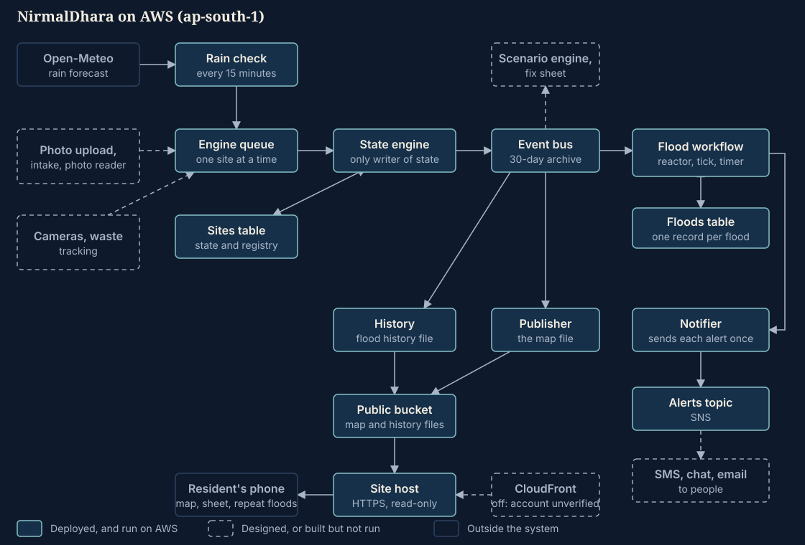

# NirmalDhara

"Clean flow": a flood warning for Hyderabad's known waterlogging points, and a record of which
places flood again and again. Built solo for Environmental Hacks (Heat and Water track),
8 to 11 October 2026.

1. **Watches before the water.** Every 15 minutes it reads the rain forecast at nine places that
   published reports say flood, and opens a *watch* at any where heavy rain is coming.
2. **Answers "can I get through?" per vehicle.** Depth is a range, never one number. Bikes, autos,
   cars, SUVs and people on foot each get "passable with care", "not safe" or "unsure"; the top of
   the range decides, and anything under 0.6 confidence is never "passable".
3. **One engine per place, one decision per flood.** A single engine owns each site's state. A flood
   workflow decides who is alerted, repeats, escalates to the next contact after five minutes
   without acknowledgement, and withdraws the warning when the flood ends. Each alert is sent once;
   a failed send is retried, and one that keeps failing raises an alarm for a person.
4. **A public map and a sheet per place.** The map shows each place as a small road cross-section
   that fills with water. Tapping one shows the depth, a to-scale drawing, and who can pass.
5. **The environmental case.** Every closed flood is kept, so a page ranks places by how long they
   blocked the road for cars. That points repair work at the drains and pumps that fail most.

**Read this before relying on it.** No photo has been read by the model yet, so the depth
readings you see come from scripts and a replay, not from camera or phone photos. The watch in
point 1 runs, but replayed over seven past seasons it would not have opened on any of the 20 days a
news report names one of these places under water: the forecast holds far less rain than falls
([docs/watch-history.md](docs/watch-history.md)). The waste-and-drain tracking half of the pitch is
designed, not built. The full list is under [What is built](#what-is-built).



## Try it

Open **https://s76zfmc6n5xd65b32tzf46dw3m0kvvik.lambda-url.ap-south-1.on.aws/** on a phone.

Unless heavy rain is forecast in Hyderabad as you look, it shows nine places, all clear, because no
real flood has been recorded. That is the true state, not a broken page. If rain is forecast, some
places show a thin ring: a watch, opened by the live forecast. Tap a place to open its sheet. Press **Key**
to see how to read the glyphs. **Repeat floods** shows the history page, which is empty until a
flood has been recorded.

To see a flood, run a replay (it plays a made-up evening into four of the real places; the map
will show those floods until you reset it; see [Replay](#replay-a-flood)).

## Run the tests

You need Python 3.11 or newer. Node.js is optional: seven test files check the web pages' logic
with Node and skip themselves if it is missing.

```bash
git clone https://github.com/ravithejanaini/NirmalDhara.git
cd NirmalDhara
python -m venv .venv
```

Activate the environment: `.venv\Scripts\activate` on Windows, `source .venv/bin/activate` on
macOS or Linux. Then:

```bash
python -m pip install -r requirements-dev.txt
python -m pytest
```

The tests need no AWS account and no network, and all of them should pass. Then try the
rules directly:

```bash
python -m nirmaldhara check --low 15 --high 25 --confidence 0.8
```

## What is built

| | What | Evidence |
|---|---|---|
| **Built and running on AWS** | Rain check every 15 minutes at nine sites, from a live forecast | Run on the deployed stack. Replayed over past seasons, its rule would not have opened a watch on any of the 20 dated flood reports found for these places (see below) |
| | State engine: one queue group per site, version-checked writes, no lost events, a repeated message counted once | `docs/smoke-test.md` |
| | Flood workflow and timer: alerts, repeat, escalation after 5 minutes, stand-down when it ends | `docs/smoke-test.md`, 21 checks passed |
| | Notifier: each alert sent once to a topic | Captured by a test queue; **no person is subscribed yet** |
| | Map file and flood-history file, kept current by two writers that cannot overwrite each other with an older picture | 0.6 to 0.7 s from a queued reading to a changed file |
| | The site: map, per-place sheet with drawing, key, repeat-floods page, served over HTTPS | The address above |
| | Replay and reset for a repeatable demonstration | Same map twice in a row |
| **Built and tested, never run on real input** | Photo reader (a Claude model on Amazon Bedrock) | Request shape only. Model access is blocked pending AWS account verification |
| | Photo checks: distance, age, duplicate, dark, blurred; crop; face and plate blur boxes | Functions with tests; no deployed handler |
| | Signed capture and acknowledgement links | Tests only |
| | Camera change gate; storage-volume curve for pump sizing | Tests only |
| | A wheel read by a person: one question with five answers, turned into a depth by wheel sizes; a page for it that says who must not go in and never who may | Tests, and the page checked in a browser on localhost. Not on the public site until `web/` is next uploaded. Nobody has tested how well people read a wheel. It is the first way a place could get depths measured at it without anyone being sent there |
| | Depth from where the water's edge sits on the ramp of a road whose profile is known, for a camera or for a person who says which mark the water has reached | Tests on made roads only. It does not end where levels learnt from end, and needs no flood watched first. No place has a profile, and no edge on a real road has been read |
| | The storage equation for a dip in a road: what a flood reveals of the ground that drains to it and how fast it empties; minutes to no-go with the road's shape taken into account; the rain that would close the road to each class | Tests and made floods only. No place has a road profile or a flood on record. From rain it is no better than the rain it is given |
| | Evaluation table and photo-to-reading script | **Simulated only.** Run on 22 drawn scenes with a stand-in reader ([docs/evaluation-simulated.md](docs/evaluation-simulated.md)). Shows the tools work and that a dangerous miss would be counted; it is not evidence of how a model reads real floods |
| | A camera fixed from several known heights, lengths and widths; two cameras placing something floating, for the speed of the water | Tests and a simulation only. No place has two cameras on one water, and none has its marks surveyed |
| | The chain from several cameras' frames to the site engine's answer | Run on rendered scenes only, with three made cameras on one water |
| | CloudFront in front of the site | In `template.yaml`, switched off: AWS has not verified the account |
| **Checked against real reports from these nine places** | The rain rule that opens a watch | [docs/watch-history.md](docs/watch-history.md). Twenty-seven dated news reports of water at these places were set against seven seasons of the rain the live system is fed. A watch would have stood on none of the 20 days a report names the place, nor on the 7 that name its area. On six of seven occasions the forecast held a twentieth to a quarter of what a rain gauge near the place recorded. Six other weather models, asked for by name, did no better |
| **Measured on a real flood, but a river in England and not a street** | Waterline detector for a fixed camera, with no model | [docs/waterline-river.md](docs/waterline-river.md). At one river lock it was 13 cm out, typically, with one reading in ten more than 54 cm out. At a second camera it was of no use |
| | A gauge that a camera learns from its own pictures and their measured levels | [docs/gauge-river.md](docs/gauge-river.md). At the same lock it gave a level for 4 pictures in 10, 8 cm out typically; together with the detector, 8 cm for nearly every picture. Learning only from earlier days, as it would be used, 31 cm. No use at two cameras with little water to learn from. It needs measured levels, and no place here has any |
| | Several reference surfaces in one view, read together | [docs/multi-reference-river.md](docs/multi-reference-river.md). At the same lock, four surfaces joined were 10 cm out, typically, against 13 cm for one, with one reading in ten still more than 46 cm out. At a second camera, where the surfaces were all one grass bank, joining gained nothing |
| | One level from every reference surface in a view, followed through time | [docs/depth-model-river.md](docs/depth-model-river.md). At the same lock, seven surfaces and the learnt gauge in one model gave every picture a level, 11 to 12 cm out, typically, with one in ten more than 41 to 47 cm out, against 13 cm and 54 cm for one surface. A small gain: surfaces in one view fail in the same light, and nothing learnt from levels can read past the levels it learnt from. Those figures are from reading between days it had learnt from: with three days in a row unseen it was 23 and 32 cm out ([docs/forecast-river.md](docs/forecast-river.md)) |
| | The prediction stage: the slope of the last readings, carried forward | [docs/forecast-river.md](docs/forecast-river.md). Its first trial on real water. From readings a camera can give it told the level ahead no better than saying "no change", and its largest misses across a night were a third to a half larger. From the measured levels it was closer across a night and no closer within a day. The engine now gives minutes only for a rise that stands clear of the doubt in the readings: a rule to say less, which this trial did not confirm |
| **Designed only** | Photo upload from phones; camera network with emergency activation; waste and drain-inlet tracking; scenario engine; fix sheet; alert channels to people (SMS, chat); acknowledgement endpoint; official console | [ARCHITECTURE.md](ARCHITECTURE.md), [METHOD.md](METHOD.md) |

## Limits

- **The rain watch would have missed the floods it was checked against.** The rule that opens a watch
  was replayed over seven seasons of the rain it is fed. It would not have opened a watch on any of the 20
  days a news report names one of these places under water. The forecast comes from a weather model on
  a grid about 8 km across, and held a fraction of the rain that gauges on the ground recorded. No
  threshold on that rain mends it. Rain measured on the ground would, and none is connected
  ([docs/watch-history.md](docs/watch-history.md)). The engine still acts on a depth reading with no
  watch open; what is lost is the asking for photos before the water comes.
- **Depth from a photo has never been measured.** The photo reader has not run against a real photo, so
  there is no accuracy figure for it. Its only table is a simulated one, on drawn scenes, and is
  labelled as such. The thresholds come from published vehicle and wheel sizes
  (METHOD.md section 17), not from a test.
- **Depth from a fixed camera has been measured, on a river and not on a street.** Two ways of reading
  a fixed camera without a model were run on published pictures of a 2012 flood in England, each with
  a measured water level. The better figure is 8 cm out, typically, with one reading in ten more than
  half a metre out. The depth bands here are 8 to 20 cm wide, so that cannot decide whether a road is
  passable, and neither is connected to the warnings. None of the nine places has a camera or a
  measured level. Those figures come from reading between days the camera had been taught on. With
  three days in a row unseen, the fullest model was 23 and 32 cm out.
- **"Cars are likely to lose passage in N minutes" has nothing real behind it.** The engine can write
  that line from the slope of its last readings. It has never been in a delivered alert. On its one
  trial on real water, a river, the slope told the level ahead no better than saying "no change"
  ([docs/forecast-river.md](docs/forecast-river.md)).
- **Nine places, from published reports.** Each has a source and date in
  [data/SOURCES.md](data/SOURCES.md). Their map positions are approximate (a few hundred metres),
  which matters for the 150 m photo-distance check and is not yet corrected.
- **A replay is a demonstration on the real map.** While one runs, the public site shows floods at
  real places. It refuses to run if anyone is subscribed to the alerts topic unless told to. A fast
  replay records real, short durations, so the repeat-floods page shows near-zero minutes blocked;
  use `--speed 1` for realistic ones.
- **No CDN.** CloudFront needs AWS to verify the account, which has not happened, so a small
  read-only Lambda serves the site. Fine for a demonstration; every page load is a function call.
  The account also allows only 10 concurrent Lambda runs in total (DESIGN.md 17.2).
- **In-country model inference is a design, not a demonstration.** The reader names an India
  inference profile; it has never been called.
- **No people are wired in yet.** The alerts go to a topic that nobody is subscribed to, there is
  no contact list, and there is no way to acknowledge an alert, so escalation to the next contact
  always happens. The smoke test proved the timing, not a delivery to a person.
- **Single region.** Everything is in Mumbai (ap-south-1). There is no second region.
- **Checked in a browser at phone size, not on a phone**, and not with a screen reader. Reduced
  motion is checked by reading the style sheets.

## Deploy

Needs the AWS SAM CLI and credentials allowed to create the stack.

```bash
sam validate --lint
sam build
sam deploy --stack-name nirmaldhara --region ap-south-1 --resolve-s3 --capabilities CAPABILITY_IAM --no-confirm-changeset
```

Deployed on 9 October 2026: 51 resources, 8 functions, 3 tables, 4 queues, an event bus with
rules and a 30-day archive, a state machine, a topic, a bucket and 3 alarms. Resource names are in
`data/stack-outputs.json`. Then:

```bash
python scripts/seed.py --apply          # the nine sites
python scripts/deploy_web.py --apply    # the pages
```

Both show what they would do when run without `--apply`. Switch CloudFront on, once AWS has
verified the account, with `--parameter-overrides EnableCloudFront=true`.

### Replay a flood

```bash
python scripts/replay.py                # shows the schedule
python scripts/replay.py --go           # plays 90 minutes in 2
python scripts/reset.py --go            # puts the four sites back to clear
```

`scripts/smoke_test.py` walks one invented site through a whole flood in about ten minutes and
writes `docs/smoke-test.md`.

## Layout

| Folder or file | Holds |
|---|---|
| `src/nirmaldhara/`, `src/handlers/` | The logic and the AWS functions; `src/` is all that is packaged for Lambda |
| `statemachine/`, `template.yaml` | The flood timer loop and the deployment template |
| `web/` | The map, the sheet, the repeat-floods page and their tests' subjects |
| `tests/` | The automated tests |
| `scripts/` | Seeding, sending, replay, reset, smoke test and file generators |
| `data/` | Site list and sources, scenarios, sample files |
| `docs/` | Smoke-test record, architecture picture, video script, submission writeup, the list of claims with their support, the reports of what was measured on a real flood, and the designs shared with defence and forecasting offices ([docs/borrowed-designs.md](docs/borrowed-designs.md)) |
| `layers/vision/` | Requirements for the photo functions, built as a layer |
| `METHOD.md`, `ARCHITECTURE.md`, `DESIGN.md`, `TASKS.md` | Method, high-level design, low-level design, task plan |

## AI tools used

- **Claude Code**, with **Claude Opus 5.5** for design, the hard parts (concurrency, the alert
  workflow, the interface's look) and review, and **Claude Sonnet 5.5** for well-specified
  routine tasks. The task plan ([TASKS.md](TASKS.md)) says which model does which task and when to
  switch. All code and documents here were written by Claude Code under my direction; the
  tests and the AWS runs described here were executed in those sessions.
- **A Claude model on Amazon Bedrock** is the intended photo reader (`src/nirmaldhara/reader.py`).
  It has not run: access is blocked pending AWS account verification.
- Not AI: AWS SAM CLI and `cfn-lint` to validate the template, MapLibre for the map, Open-Meteo
  for the rain forecast.

## Sources

- Thresholds and rules: [METHOD.md](METHOD.md) section 17.
- The nine places: [data/SOURCES.md](data/SOURCES.md).
- Map data, rain forecast and type: [web/CREDITS.md](web/CREDITS.md). Map data © OpenStreetMap
  contributors; tiles from OpenFreeMap; weather data by Open-Meteo.com (CC BY 4.0).
- What was tested on AWS: [docs/smoke-test.md](docs/smoke-test.md).
- River camera pictures and water levels used to measure the camera reading: Vetra-Carvalho, Dance,
  Mason and Garcia-Pintado (2020), Mendeley Data, doi:10.17632/769cyvdznp.1, copyright University of
  Reading, pictures by Farson Digital Ltd. Its page says CC BY 4.0 and its own README links to
  CC BY-NC 4.0; it is treated here as the stricter. The pictures are not in this repository:
  [samples/tewkesbury/CREDITS.md](samples/tewkesbury/CREDITS.md).

MIT licence, see [LICENSE](LICENSE).
